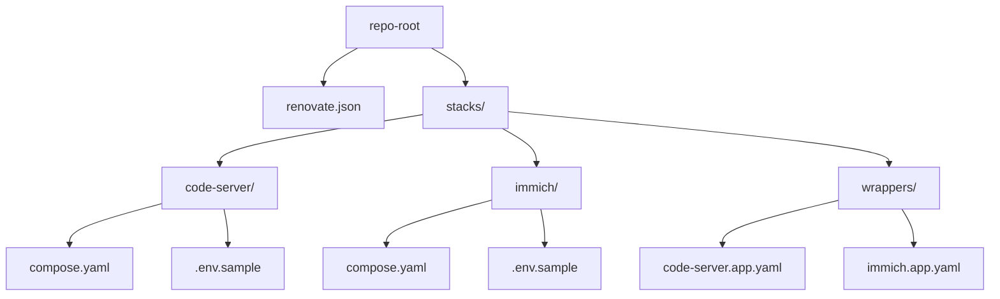

# BYO-NAS Stacks (TrueNAS SCALE + Docker Compose)

This repository contains the **Docker Compose stacks** and **TrueNAS Apps wrappers** for a self‑hosted media and productivity server. It’s built for a Minisforum **N5 Pro** (AMD iGPU) running **TrueNAS SCALE 25.10** with:

- NVMe pool `fast` for app data/config
- HDD pool `tank` for media
- TrueNAS **Apps → Install via YAML** using an *include* wrapper
- **GitOps** workflow (+ **Renovate**) to keep images fresh with pinned digests
- **Users/permissions** pattern: `apps:apps` service account owns stacks and appdata; you work as `damian` (member of `apps`)

Current stacks:
- **code-server** (LinuxServer) – browser VS Code
- **Immich** (server + CPU‑ML + valkey + pinned Postgres) – private photo library with face/thing detection

> Traefik & Pangolin can be layered later using the same include pattern.

---

## TL;DR (Quickstart)

```bash
# One-time Git safety (repo owned by group 'apps')
git config --global --add safe.directory /mnt/fast/stacks
git config --global user.name  "Your Name"
git config --global user.email "you@example.com"
git config --global core.sharedRepository group

# Commit compose & wrappers (keep .env untracked; commit .env.sample)
git add stacks/**/compose.yaml stacks/**/.env.sample renovate.json
git commit -m "init: code-server + immich stacks with pinned images"
```

Deploy each stack in TrueNAS: **Apps → Discover Apps → Install via YAML → paste wrapper**

```yaml
# stacks/wrappers/code-server.app.yaml
services: {}
include:
  - /mnt/fast/stacks/code-server/compose.yaml
```

```yaml
# stacks/wrappers/immich.app.yaml
services: {}
include:
  - /mnt/fast/stacks/immich/compose.yaml
```

---

## Repository Layout

```text
repo-root/
├─ renovate.json
└─ stacks/
   ├─ code-server/
   │  ├─ compose.yaml
   │  ├─ .env            # ignored (PUID/PGID/TZ)
   │  └─ .env.sample     # non-secret template
   ├─ immich/
   │  ├─ compose.yaml
   │  ├─ .env            # ignored (paths, DB creds, TZ)
   │  └─ .env.sample
   └─ wrappers/
      ├─ code-server.app.yaml
      └─ immich.app.yaml
```



---

## Runtime Architecture (TrueNAS + Docker)

```mermaid
flowchart LR
    U[Clients (LAN/WAN)] -- HTTPS:8443 --> CS[code-server]
    U -- HTTPS:2283 --> IM[Immich Server]

    subgraph Docker
      CS --- V1[/mnt/fast/appdata/code-server:/config/]
      IM --- V2[/mnt/tank/media/photos:/data/]
      IM --- DRI[/dev/dri]:::dev

      ML[Immich ML (CPU)] --- V3[(model-cache)]
      R[Valkey]:::svc
      DB[(Postgres (pinned))]:::db --- V4[/mnt/fast/appdata/immich/postgres]
    end

    classDef svc fill:#eef,stroke:#66f,stroke-width:1px;
    classDef db fill:#efe,stroke:#4a4,stroke-width:1px;
    classDef dev fill:#fee,stroke:#e66,stroke-width:1px;
```

- **/dev/dri** is mapped into *immich-server* for VAAPI decode/encode on AMD iGPU (video previews).  
- *immich-machine-learning* is CPU-only in this build (stable everywhere). Re-enable ROCm later if `/dev/kfd` exists and Immich’s ROCm image supports your GPU.

---

## Users, Groups & Permissions

- **Service owner:** `apps:apps` (no login) owns `/mnt/fast/stacks` and `/mnt/fast/appdata`
- **Your user:** `damian` belongs to `apps` group (not a GUI admin)
- **Git safety:** repo marked safe for group ownership (`safe.directory`)

Recommended POSIX modes on the host:
```bash
# roots
chown -R apps:apps /mnt/fast/stacks /mnt/fast/appdata
chmod g+s /mnt/fast/stacks /mnt/fast/appdata
find /mnt/fast/{stacks,appdata} -type d -exec chmod 2775 {} \;
find /mnt/fast/{stacks,appdata} -type f -exec chmod 0664 {} \;

# EXCEPT database folders (Postgres wants postgres:postgres and 700)
chown -R postgres:postgres /mnt/fast/appdata/immich/postgres
chmod 700 /mnt/fast/appdata/immich/postgres
```

TrueNAS datasets used:
- `tank/media/photos` → Immich library originals (`/data`)
- `fast/appdata/immich` (+ `/immich/postgres`) → config + DB
- `fast/appdata/code-server` → config

---

## Stacks

### code-server

- Image: `lscr.io/linuxserver/code-server` (pinned digest; see compose)
- Ports: `8443:8443`
- Volumes:
  - `/mnt/fast/appdata/code-server:/config`
  - `/mnt/fast/stacks:/stacks` (so you can edit other stack files in VS Code)
- Env (in `.env` – ignored): `PUID=568`, `PGID=568`, `TZ=Europe/Dublin`

### Immich (server + ML + valkey + Postgres)

- **Server**: `ghcr.io/immich-app/immich-server:release@sha256:...`
  - `devices: /dev/dri` for VAAPI
  - Mounts `/mnt/tank/media/photos:/data` (library originals)
- **Machine Learning**: CPU-only (`immich-machine-learning:release@sha256:...`)
  - `EXECUTION_PROVIDERS=CPUExecutionProvider`
  - Optional ROCm later if `/dev/kfd` exists & image supports it
- **Valkey**: pinned (`valkey:8-bookworm@sha256:...`)
- **Postgres**: **pinned** image/tag+digest from Immich’s compose (no Renovate)
  - Data at `/mnt/fast/appdata/immich/postgres`
  - **Must be `postgres:postgres` and `700`**

`.env` (ignored by Git) carries paths and DB credentials; add a `.env.sample` with placeholders for onboarding.

---

## TrueNAS Apps Wrappers

We use a tiny wrapper file per app to satisfy the TrueNAS YAML validator and include the real compose:

```yaml
# stacks/wrappers/<name>.app.yaml
services: {}
include:
  - /mnt/fast/stacks/<name>/compose.yaml
```

- Paste the wrapper in **Apps → Install via YAML**.
- On updates, edit files under `stacks/<name>/` and click **Update/Upgrade** on the app.  
- Do **not** include `.env` in the wrapper – it’s not YAML.

---

## Renovate (Automated Dependency Updates)

This repository uses **Renovate** to automatically keep Docker images updated with intelligent automation rules designed for security, stability, and minimal maintenance overhead.

### 🎯 **Design Philosophy**

- **Security-first**: Critical components (reverse proxy, auth) get digest pinning for supply chain protection
- **Developer-friendly**: Development tools get fast updates without digest constraints
- **Selective automation**: Auto-merge safe updates, manual review for breaking changes
- **Stack-aware**: Different rules per service type with appropriate risk management

### 📋 **Current Update Strategy**

| Component Type | Auto-merge | Digest Pinned | Schedule | Reasoning |
|---------------|------------|---------------|----------|-----------|
| **Security-Critical** | ❌ Manual | ✅ Yes | Any time | Supply chain protection |
| - traefik | ❌ Manual | ✅ Yes | Any time | Reverse proxy - security boundary |
| - authelia | ❌ Manual | ✅ Yes | Any time | Authentication service |
| **Development Tools** | ✅ Patch/Minor | ❌ No | Any time | Fast updates more valuable |
| - code-server | ✅ Patch/Minor | ❌ No | Any time | Development environment |
| - socket-proxy | ✅ Patch/Minor | ❌ No | Any time | Internal Docker proxy |
| **Application Stack** | ❌ Manual | ❌ No | Any time | Breaking changes possible |
| - immich-server | ❌ Manual | ❌ No | Any time | Photo management app |
| - immich-machine-learning | ❌ Manual | ❌ No | Any time | ML models may break |
| **Infrastructure** | 🔒 Disabled | 🔒 Pinned | Never | Critical stability |
| - postgres (Immich) | 🔒 Disabled | 🔒 Pinned | Never | Database schema stability |
| - valkey/redis (Immich) | 🔒 Disabled | 🔒 Pinned | Never | Data persistence safety |

### ⚡ **Automation Behavior**

**Immediate Auto-merge (1-3 hours after release):**
- Patch updates for development tools (code-server, socket-proxy)
- Minor updates for development tools (after 3 hour safety delay)

**Manual Review Required:**
- Major version updates for any component
- Any updates to application stacks (Immich)
- Security-critical component updates (traefik, authelia)

**Completely Disabled:**
- Database components (postgres, redis/valkey) 
- Updates only via manual configuration changes

### 🏗 **Configuration Structure**

```json
{
  "$schema": "https://docs.renovatebot.com/renovate-schema.json",
  "extends": ["config:recommended"],
  "pinDigests": false,  // Selective pinning only
  "enabledManagers": ["docker-compose", "dockerfile"],
  
  // Custom file discovery for modular compose structure
  "docker-compose": {
    "fileMatch": [
      "(^|/)(compose\\.ya?ml|docker-compose\\.ya?ml)$",
      "traefik/authelia\\.ya?ml$",
      "traefik/socket-proxy\\.ya?ml$", 
      "traefik/traefik\\.ya?ml$"
    ]
  },
  
  "packageRules": [
    // Auto-merge safe updates (patch/minor for dev tools)
    {
      "matchDatasources": ["docker"],
      "matchUpdateTypes": ["patch", "digest"],
      "automerge": true,
      "minimumReleaseAge": "1 hour"
    },
    {
      "matchDatasources": ["docker"], 
      "matchUpdateTypes": ["minor"],
      "automerge": true,
      "minimumReleaseAge": "3 hours"
    },
    
    // Security-critical components: digest pinning
    {
      "matchPackageNames": ["traefik", "authelia/authelia"],
      "pinDigests": true,
      "addLabels": ["security-critical", "digest-pinned"]
    },
    
    // Immich components: manual review
    {
      "matchPackageNames": ["/immich-server/", "/immich-machine-learning/"],
      "automerge": false,
      "addLabels": ["stack:immich", "manual-review-required"]
    },
    
    // Infrastructure: completely disabled
    {
      "matchPackageNames": ["postgres", "ghcr.io/immich-app/postgres"],
      "enabled": false,
      "addLabels": ["pinned", "manual-update-only"]
    }
  ]
}
```

### 🔄 **Workflow Integration**

1. **Dependency Detection**: Scans all compose files including modular traefik/*.yaml files
2. **PR Creation**: Creates labeled PRs with appropriate update types
3. **Auto-merge**: Safe updates merge automatically after release age delays
4. **Manual Review**: Breaking changes wait for your approval
5. **Dashboard**: [Dependency Dashboard](../../issues/3) shows all detected dependencies

### 🏷 **Label Strategy**

PRs are automatically labeled for easy filtering:

- `renovate` - All renovate PRs
- `update:major|minor|patch|digest` - Update type
- `automerge` + `safe` - Auto-mergeable updates  
- `manual-review-required` - Needs human approval
- `security-critical` + `digest-pinned` - Security components
- `stack:immich|traefik|code-server` - Service grouping
- `pinned` + `manual-update-only` - Disabled updates

### 🛡 **Security Features**

**Digest Pinning** for security-critical components:
```yaml
# Before: version only
image: traefik:v3.5.3

# After: version + digest pin  
image: traefik:v3.5.3@sha256:84eb6c0e67c99fa026bf1bf4b0afd9ad44350d375b4ebc5049c5f70543a729d6
```

This prevents supply chain attacks where malicious code is injected into existing tags.

**Controlled Release Ages**:
- Patch updates: 1 hour minimum age
- Minor updates: 3 hours minimum age  
- Major updates: Manual review only

### 📊 **Monitoring & Maintenance**

- **Dashboard**: Check [Dependency Dashboard](../../issues/3) for status
- **PR Queue**: Review open renovate PRs for manual approval
- **Config Updates**: Renovate will create config migration PRs when needed
- **Manual Triggers**: Check the dashboard checkbox to force immediate runs

### 🛠 **Manual Operations**

When you need to manually update disabled components:

```bash
# Check current digests
docker pull ghcr.io/immich-app/postgres:14-vectorchord0.4.3-pgvectors0.2.0
docker image inspect ghcr.io/immich-app/postgres:14-vectorchord0.4.3-pgvectors0.2.0 --format '{{index .RepoDigests 0}}'

# Update compose.yaml with new digest
# Commit changes and deploy
```

### 🎨 **Recommended GitHub Labels**

Create these labels in your repository for better PR organization:
- `renovate` (blue)
- `automerge` (green) 
- `manual-review-required` (orange)
- `security-critical` (red)
- `digest-pinned` (purple)
- `stack:immich` (light blue)
- `stack:traefik` (dark blue)
- `stack:code-server` (yellow)
- `update:major` (red)
- `update:minor` (orange)  
- `update:patch` (green)

---

## Backups & Snapshots

- **App config** (`/mnt/fast/appdata/**`): periodic ZFS snapshots; replicate off-box if you can
- **Immich DB**: snapshot the dataset + consider periodic `pg_dump` for point-in-time recovery
- **Immich library** (`/mnt/tank/media/photos`): snapshot & replicate
- **Time Machine**: configured as an SMB “Time Machine Share” on its own dataset with a ZFS **quota**

---

## Troubleshooting

- **“YAML missing required `services` key”** in Apps → Install via YAML  
  Use the wrapper with `services: {}` then `include: /path/to/compose.yaml`. Don’t include `.env` there.
- **“top-level object must be a mapping”**  
  You included a non‑YAML file (like `.env`) in `include:`. Remove it.
- **Postgres won’t start after chown**  
  Ensure `/mnt/fast/appdata/immich/postgres` is `postgres:postgres` and `700`. If unsure, run a one‑off container to fix:
  ```bash
  docker run --rm -v /mnt/fast/appdata/immich/postgres:/var/lib/postgresql/data \
    ghcr.io/immich-app/postgres:16 bash -lc 'chown -R postgres:postgres /var/lib/postgresql/data; chmod 700 /var/lib/postgresql/data'
  ```
- **SSH key auth failing**  
  Home dir or `.ssh` perms too open. Ensure: `~`=750, `~/.ssh`=700, `authorized_keys`=600 (owned by the user).

---

## Conventions

- **Paths**: absolute host paths in compose (`/mnt/...`) for reliability with TrueNAS Apps
- **.env**: contains non‑committed secrets/paths; commit `.env.sample` only
- **Digest pinning**: `image: tag@sha256:...`
- **Group model**: `apps:apps` owns; `damian` edits via group; GUI admin stays separate

---

## Roadmap

- Add **Traefik** network + labels to stacks (t3_proxy), Authelia chain
- Enable **ROCm** ML when supported (`/dev/kfd` present; image supports your GPU)
- Add more stacks (Arrs/Jellyfin/N8N/Immich add‑ons) using the same include pattern
- Add Renovate rules per new stack with appropriate risk labels

---

Happy self‑hosting! 🚀
