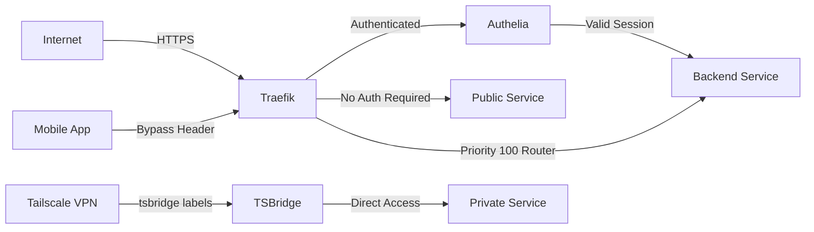

# Selfhost Stacks (Proxmox VE + Docker Compose)

This repository contains **Docker Compose stacks** deployed on **Proxmox VE 9.1** (Debian 13 Trixie) using Infrastructure as Code (Terraform) with:

- **Proxmox Host**: `atlantis` (172.16.1.158) - AMD Ryzen 5800H with Radeon 890M iGPU
- **LXC 100** `selfhost` (172.16.1.159) - Main application stack (77 containers across 23 stacks)
- **LXC 101** `openclaw` (172.16.1.160) - AI assistant service
- **GPU Acceleration**: AMD Radeon 890M (16.5 GiB VRAM) - hardware transcoding for Jellyfin, Immich, Dispatcharr, Ollama (Vulkan)
- **Storage**: ZFS pools - `fast` (1.4TB NVMe mirror) for appdata, `tank` (multi-TB raidz1) for media
- **Networking**: Traefik reverse proxy with Cloudflare DNS + Authelia SSO + Tailscale VPN (tsbridge)
- **GitOps**: Automated updates with Renovate, pinned image digests
- **Permissions**: `apps:apps` (568:568) service account owns stacks and appdata

## 📊 Deployment Overview

**Infrastructure**: Proxmox VE 9.1 → Debian 13 LXC → Docker 28.1.0 → 77 Containers
- **GPU passthrough**: /dev/dri/card1, /dev/dri/renderD128 (video:44, render:110, apps:568)
- **Networks**: 15 Docker networks (t3_proxy, socket_proxy, openwebui, dawarich, keeper, etc.)
- **Reverse Proxy**: Traefik 3.3.4 with Authelia 4.39.15
- **VPN Access**: Tailscale tsbridge (9 services exposed to Tailnet)

## 📦 Current Stacks

### 🛡️ Infrastructure (4 containers)
- **Traefik** v3.3.4 – Reverse proxy with automatic HTTPS (Cloudflare DNS-01)
- **Authelia** v4.39.15 – Single Sign-On authentication middleware  
- **Socket Proxy** – Docker socket security proxy (read-only access)
- **TSBridge** v0.13.1 – Tailscale service bridge (auto-discovery via Docker labels)

### 🎬 Media Acquisition (19 containers)
- **Prowlarr** – Indexer proxy/aggregator for Usenet & torrent trackers
- **Radarr** – Movie collection manager with automated downloads
- **Sonarr** – TV series collection manager with automated downloads
- **Lidarr** – Music collection manager with automated downloads
- **Readarr** – Ebook & audiobook collection manager (Bookshelf fork)
- **Bazarr** – Subtitle companion for Radarr/Sonarr
- **SABnzbd** – Usenet downloader (NZB client)
- **qBittorrent** – Torrent downloader
- **FlareSolverr** – Cloudflare/DDoS protection bypass proxy
- **Autobrr** – IRC announce grabber for racing/tracker automation
- **Janitorr** – Media library cleanup automation
- **Blockbusterr** – Media collection gaps/wishlist management
- **Exporters** (7) – Prometheus metrics for Radarr, Sonarr, Lidarr, Readarr, Bazarr, Prowlarr, SABnzbd

### 🎥 Media Serving (5 containers)
- **Jellyfin** – Media server with AMD GPU hardware transcoding (VA-API)
- **Jellyseerr** – Media request & discovery management
- **Jellystat** – Jellyfin analytics and statistics dashboard
- **Wizarr** – User invitation & management system for Jellyfin
- **Dispatcharr** v0.19.0 – Arr app notification & live TV transcoding proxy (GPU accelerated)

### 🖼️ Photos & Files (5 containers)
- **Immich** v2.5.6 – Private photo library with face/object detection, ML features (4 containers: server, ML, postgres, redis)
- **Open-Archiver** – Email archiving service with search (4 containers: api, meilisearch, postgres, tika)

### 🤖 AI / LLM (9 containers)
- **Open WebUI** – AI chat interface with model hub, tools, and knowledge base
- **Ollama** v0.15.6 – LLM inference engine with AMD GPU acceleration (Vulkan)
- **Docling** v1.12.0 – Document understanding and conversion API
- **EdgeTTS** – Text-to-speech synthesis service
- **SearXNG** 2025.10.4 – Privacy-focused metasearch engine
- **PostgreSQL** + **Redis** + **Tika** – Supporting services for AI stack

### 🔧 Development & Productivity (18 containers)
- **code-server** v4.108.2 – Browser-based VS Code
- **Keeper.sh** – Calendar and scheduling (5 containers: web, api, cron, postgres, redis)
- **Karakeep** – Bookmark and content manager (5 containers: web, workers, chrome, meilisearch, mcp)
- **FreshRSS** v1.28.1 – RSS/Atom feed aggregator
- **Homarr** v1.49.1 – Dashboard for services
- **Dawarich** – Location tracking (4 containers: app, sidekiq, postgres, redis)
- **Postiz** – Social media management (3 containers: app, postgres, redis)
- **Termix** – Terminal sharing service
- **Podsync** – Podcast sync service

### ⚙️ Automation & Operations (6 containers)
- **N8N** v2.7.2 – Workflow automation platform
- **Oxidized** – Network device configuration backup
- **PWPush** – Secure password sharing with expiration
- **Falcon Player (FPP)** – Holiday lighting/audio controller
- **Tesla Static** – Tesla Fleet API key hosting

### 🎮 Gaming (2 containers)
- **Minecraft Vanilla** – Bedrock server (exposed via Tailscale: mc-vanilla)
- **Minecraft Yggdrasil** – Bedrock server (exposed via Tailscale: mc-ygg)

---

## 🌐 Service Access Matrix
| **Readarr** | https://readarr.deercrest.info | 8787, 9713 (exporter) | Authelia | ✅ Header-based | Ebook/audiobook manager |


### 🛡️ Infrastructure Services

| Service | Access URL | Local Port | Middleware | Tailscale | GPU | Notes |
|---------|-----------|------------|------------|-----------|-----|-------|
| **Traefik** | https://traefik.deercrest.info | 80, 443 | chain-authelia | No | No | Reverse proxy dashboard |
| **Authelia** | https://auth.deercrest.info | 9091 | chain-no-auth | No | No | SSO authentication portal |
| **Socket Proxy** | - | 2375 (internal) | - | No | No | Docker API security layer |
| **TSBridge** | - | - | - | Yes | No | Tailscale service bridge |

### 🎬 Media Serving & Requests

| Service | Access URL | Local Port | Middleware | Tailscale | GPU | Notes |
|---------|-----------|------------|------------|-----------|-----|-------|
| **Jellyfin** | https://jellyfin.deercrest.info | 8096 | chain-no-auth | No | ✅ VA-API | Hardware transcoding enabled |
| **Jellyseerr** | https://seerr.deercrest.info | 5055 | chain-no-auth | No | No | Media request management |
| **Jellystat** | https://jellystat.deercrest.info | 127.0.0.1:3003 | chain-authelia | No | No | Analytics & statistics |
| **Wizarr** | https://wizarr.deercrest.info | 5690 | chain-no-auth | No | No | User invitations |
| **Dispatcharr** | https://dispatcharr.deercrest.info | 9191 | chain-authelia | No | ✅ VA-API | Arr notifications + live TV proxy |

### 📺 Media Acquisition (Arr Stack)

| Service | Access URL | Local Port | Middleware | Tailscale | GPU | Bypass Router | Notes |
|---------|-----------|------------|------------|-----------|-----|---------------|-------|
| **Prowlarr** | https://prowlarr.deercrest.info | 9696 | chain-authelia | No | No | No | Indexer proxy |
| **Radarr** | https://radarr.deercrest.info | 7878 | chain-authelia | No | No | ✅ Header-based | Movies |
| **Sonarr** | https://sonarr.deercrest.info | 8989 | chain-authelia | No | No | ✅ Header-based | TV series |
| **Lidarr** | https://lidarr.deercrest.info | 8686 | chain-authelia | No | No | ✅ Header-based | Music |
| **Readarr** | https://readarr.deercrest.info | 8787 | chain-authelia | No | No | ✅ Header-based | Ebooks/audiobooks |
| **Bazarr** | https://bazarr.deercrest.info | 6767 | chain-authelia | No | No | No | Subtitles |
| **SABnzbd** | https://sabnzbd.deercrest.info | 8084 | chain-authelia | No | No | No | Usenet downloader |
| **qBittorrent** | https://qbittorrent.deercrest.info | 7889 | chain-authelia | No | No | No | Torrent downloader |
| **FlareSolverr** | - | 8191 (internal) | - | No | No | - | Cloudflare bypass |
| **Autobrr** | https://autobrr.deercrest.info | 7474 | chain-authelia | No | No | No | IRC announce grabber |
| **Janitorr** | https://janitorr.deercrest.info | 127.0.0.1:5000 | chain-authelia | No | No | No | Media cleanup |
| **Blockbusterr** | https://blockbusterr.deercrest.info | 127.0.0.1:8001 | chain-authelia | No | No | No | Collection gaps |
| **wrtag** | - | - (internal) | - | No | No | - | Music metadata editor |

**Prometheus Exporters** (7 containers): radarr, sonarr, lidarr, readarr, prowlarr, bazarr, sabnzbd – ports 9707-9713

**Bypass Routers**: Services marked with ✅ have a secondary router (priority 100) that accepts requests with a custom header (`{service}-auth-bypass-key`) without requiring Authelia authentication. This enables mobile apps like LunaSea, Helmarr, and nzb360 to connect directly.

### 🖼️ Photos & Files

| Service | Access URL | Local Port | Middleware | Tailscale | GPU | Notes |
|---------|-----------|------------|------------|-----------|-----|-------|
| **Immich** | https://immich.deercrest.info | 127.0.0.1:2283 | chain-no-auth | ✅ photos.pirate-clownfish.ts.net | ✅ Vulkan | ML inference (4 containers) |
| **Open-Archiver** | https://archiver.deercrest.info | 127.0.0.1:3005 | chain-authelia | No | No | Email archiving (5 containers) |

### 🤖 AI & LLM Stack

| Service | Access URL | Local Port | Middleware | Tailscale | GPU | Notes |
|---------|-----------|------------|------------|-----------|-----|-------|
| **Open WebUI** | https://ai.deercrest.info | 127.0.0.1:8080 | chain-authelia | ✅ ai.pirate-clownfish.ts.net | Via Ollama | Chat interface (9 containers) |
| **Ollama** | - | 11434 | - | No | ✅ Vulkan | LLM inference engine |
| **SearXNG** | - | 8080 (internal) | - | No | No | Metasearch for RAG |
| **Docling** | - | 5000 (internal) | - | No | No | Document conversion |
| **EdgeTTS** | - | 5050 (internal) | - | No | No | Text-to-speech |

### 🔧 Development & Productivity

| Service | Access URL | Local Port | Middleware | Tailscale | GPU | Notes |
|---------|-----------|------------|------------|-----------|-----|-------|
| **code-server** | https://code.deercrest.info | 127.0.0.1:8444 | chain-authelia | ✅ code.pirate-clownfish.ts.net | No | Browser VS Code |
| **Keeper.sh** | https://keeper.deercrest.info | 127.0.0.1:3000 | middlewares-keeper | No | No | Calendar & scheduling (5 containers) |
| **Keeper API** | https://keeper-api.deercrest.info | 127.0.0.1:3001 | middlewares-keeper-api | No | No | Backend API |
| **Karakeep** | https://karakeep.deercrest.info | 127.0.0.1:3002 | chain-authelia | No | No | Bookmark manager (5 containers) |
| **Karakeep MCP** | - | 127.0.0.1:3004 | - | No | No | Model Context Protocol server |
| **FreshRSS** | https://freshrss.deercrest.info | 80 (internal) | chain-no-auth | No | No | RSS aggregator |
| **Homarr** | https://homarr.deercrest.info | 7575 | chain-authelia | No | No | Services dashboard |
| **Dawarich** | https://dawarich.deercrest.info | 127.0.0.1:3000 | chain-authelia | No | No | Location tracking (4 containers) |
| **Postiz** | https://postiz.deercrest.info | 127.0.0.1:5000 | chain-no-auth | No | No | Social media mgmt (3 containers) |
| **Termix** | https://termix.deercrest.info | 8000 | chain-authelia | No | No | Terminal sharing |

### ⚙️ Automation & Operations

| Service | Access URL | Local Port | Middleware | Tailscale | GPU | Notes |
|---------|-----------|------------|------------|-----------|-----|-------|
| **N8N** | https://n8n.deercrest.info | 5678 | middlewares-n8n | No | No | Workflow automation |
| **Oxidized** | https://oxidized.deercrest.info | 8888 | chain-authelia | No | No | Network backups |
| **PWPush** | https://pwpush.deercrest.info | 5100 | chain-no-auth | No | No | Secure password sharing |
| **Falcon Player** | https://fpp.deercrest.info | 80 (internal) | chain-authelia | No | No | Holiday lighting |
| **Tesla Static** | - | 8099 (internal) | - | No | No | Tesla Fleet API keys |
| **Podsync** | - | 8080 (internal) | - | No | No | Podcast sync |

### 🎮 Gaming

| Service | Access URL | Local Port | Middleware | Tailscale | GPU | Notes |
|---------|-----------|------------|------------|-----------|-----|-------|
| **Minecraft Vanilla** | - | 19132-19133/udp | - | ✅ mc-vanilla.pirate-clownfish.ts.net | No | Bedrock server |
| **Minecraft Yggdrasil** | - | 19142-19143/udp | - | ✅ mc-ygg.pirate-clownfish.ts.net | No | Bedrock server |

---

## 📍 Port Reference

### Public Ports (0.0.0.0)
- **80, 443** – Traefik HTTP/HTTPS
- **11434** – Ollama API
- **19132-19133/udp** – Minecraft Vanilla
- **19142-19143/udp** – Minecraft Yggdrasil

### Local Ports (127.0.0.1) - Traefik Only
- **2283** – Immich
- **3000** – Keeper UI / Dawarich
- **3001** – Keeper API
- **3002** – Karakeep
- **3003** – Jellystat
- **3004** – Karakeep MCP
- **3005** – Open-Archiver
- **5000** – Janitorr / Postiz
- **8001** – Blockbusterr
- **8080** – Open WebUI
- **8444** – code-server

### Internal Ports (container-to-container)
- **2375** – Socket Proxy (Docker API)
- **5000** – Docling
- **5050** – EdgeTTS
- **8080** – SearXNG / Podsync
- **8099** – Tesla Static
- **8191** – FlareSolverr

---

## 🌐 Network Architecture

### Docker Networks

| Network | Purpose | Services |
|---------|---------|----------|
| **t3_proxy** | Main Traefik routing network | 40+ services requiring reverse proxy |
| **socket_proxy** | Docker API security isolation | Traefik + socket-proxy |
| **iot_macvlan** | IoT device VLAN (direct IP addressing) | Specialized IoT services |
| **openwebui** | AI stack isolation | Open WebUI, Ollama, Docling, EdgeTTS, SearXNG |
| **dawarich** | Location tracking stack | Dawarich app + Sidekiq + Postgres + Redis |
| **keeper** | Calendar stack | Keeper web + API + Cron + Postgres + Redis |
| **postiz** | Social media stack | Postiz app + Postgres + Redis |
| **karakeep** | Bookmark stack | Karakeep web + Workers + Chrome + Meilisearch |
| **minecraft** | Gaming network | Minecraft Vanilla + Yggdrasil servers |
| **immich** | Photo library network | Immich server + ML + Postgres + Redis |

### Access Flow Patterns



**Request Flow**:
1. **Public Access** (chain-no-auth): Internet → Traefik → Service (Jellyfin, Immich, etc.)
2. **Authenticated Access** (chain-authelia): Internet → Traefik → Authelia SSO → Service
3. **Mobile Bypass**: Mobile App → Traefik (with bypass header) → Service (header validation)
4. **Tailscale Access**: Tailnet → TSBridge → Service (no Traefik, no auth)

---

## 🔧 Middleware Configuration

**chain-authelia**: Full SSO authentication via Authelia (default for admin services)
- Requires login at https://auth.deercrest.info
- Session management with Redis backend
- MFA support (TOTP, WebAuthn)
- Applied to: Arrs stack, Jellystat, Homarr, Dispatcharr, code-server, Karakeep, Dawarich, Oxidized

**chain-no-auth**: No authentication required (public services)
- Direct access without login
- Applied to: Jellyfin, Immich, Jellyseerr, Wizarr, Authelia, FreshRSS, PWPush, Postiz

**middlewares-keeper**: Custom middleware for Keeper.sh calendar (CORS + headers)

**middlewares-keeper-api**: Custom middleware for Keeper API (CORS + rate limiting)

**middlewares-n8n**: Custom middleware for N8N (WebSocket support + headers)

**Bypass Routers**: Header-based bypass for mobile apps
- Header format: `{service}-auth-bypass-key: {SECRET_FROM_ENV}`
- Priority: 100 (evaluated before main router)
- Entrypoint: websecure only
- Used by: LunaSea, nzb360, Helmarr iOS apps
- Services: Radarr, Sonarr, Lidarr, Readarr, SABnzbd

---

## 🖥️ Hardware Acceleration

**AMD Radeon 890M iGPU** (16.5 GiB VRAM) passed through to LXC 100:
- **/dev/dri/card1** - GPU device
- **/dev/dri/renderD128** - Render node
- **Group IDs**: video:44, render:110 (mapped to apps:568 in container)

**GPU-Accelerated Services**:
- **Jellyfin** – VA-API hardware transcoding (H.264, HEVC, VP9)
- **Immich** – Vulkan ML inference (face detection, object recognition)
- **Dispatcharr** – VA-API live TV transcoding
- **Ollama** – Vulkan LLM inference (llama3.3:latest, qwen2.5-coder:14b)

**Verification**:
```bash
# Inside LXC 100
ls -la /dev/dri/
# card1 -> video:44, renderD128 -> render:110

docker exec jellyfin vainfo
# VA-API version 1.22.0, RADV driver

docker exec ai-ollama ollama ps
# llama3.3:latest loaded (Vulkan acceleration)
```

---

## 📂 Repository Layout

```text
/
├── README.md                       # This file
├── DEPLOYMENT.md                   # Deployment procedures & troubleshooting
├── PROXMOX_MIGRATION.md           # Migration notes from TrueNAS SCALE
├── STANDARDS.md                    # Code standards & conventions
├── renovate.json                   # Automated dependency updates
├── infrastructure/
│   └── proxmox/                   # Terraform IaC for Proxmox VE
│       ├── providers.tf           # Proxmox provider config
│       ├── variables.tf           # Input variables
│       ├── terraform.tfvars       # Variable values (gitignored)
│       ├── lxc-selfhost.tf       # LXC 100 (main stacks)
│       ├── lxc-openclaw.tf       # LXC 101 (AI assistant)
│       └── host.tf                # Proxmox host configuration
├── scripts/
│   ├── check-renovate.sh          # Renovate config validator
│   ├── backup-truenas-settings.sh # TrueNAS config backup (legacy)
│   ├── restore-settings-to-lxc.sh # Deploy settings to LXC
│   └── setup-teleport.sh          # Teleport installation
├── arrs/                          # Media acquisition (19 containers)
│   ├── compose.yaml               # Main orchestrator
│   ├── prowlarr.yaml, radarr.yaml, sonarr.yaml, lidarr.yaml, readarr.yaml
│   ├── bazarr.yaml, sabnzbd.yaml, qbittorrent.yaml
│   ├── flaresolverr.yaml, autobrr.yaml, janitorr.yaml
│   ├── blockbusterr.yaml, boxarr.yaml, soulbeet.yaml
│   └── beets/                     # Music tagging config
├── media/                         # Media serving (5 containers)
│   ├── compose.yaml
│   ├── jellyfin.yaml, seerr.yaml, jellystat.yaml
│   ├── wizarr.yaml, dispatcharr.yaml
├── traefik/                       # Reverse proxy infrastructure (4 containers)
│   ├── compose.yaml
│   ├── traefik.yaml, authelia.yaml
│   ├── socket-proxy.yaml, tsproxy.yaml
├── automation/                    # Automation & ops (6 containers)
│   ├── compose.yaml
│   ├── n8n.yaml, oxidized.yaml, pwpush.yaml
│   ├── falcon-player.yaml, tesla-static.yaml
│   └── n8n/                       # N8N workflow backups
├── immich/                        # Photo library (4 containers)
│   └── compose.yaml               # Immich + ML + Postgres + Redis
├── openwebui/                     # AI/LLM stack (9 containers)
│   ├── compose.yaml               # Open WebUI + Ollama + Docling + EdgeTTS + SearXNG
│   └── README.md                  # AI stack documentation
├── open-archiver/                 # Email archiving (5 containers)
│   └── compose.yaml               # API + Postgres + Redis + Meilisearch + Tika
├── code-server/                   # Development IDE
│   └── compose.yaml
├── keeper-sh/                     # Calendar/scheduling (5 containers)
│   └── compose.yaml               # Web + API + Cron + Postgres + Redis
├── karakeep/                      # Bookmark manager (5 containers)
│   └── compose.yaml               # Web + Workers + Chrome + Meilisearch + MCP
├── freshrss/, homarr/, dawarich/, postiz/, termix/, podsync/
│   └── compose.yaml
├── minecraft/                     # Game servers (2 containers)
│   ├── compose.yaml
│   ├── mc-vanilla.yaml            # Bedrock server (tsbridge)
│   └── mc-yggdrasil.yaml          # Bedrock server (tsbridge)
├── teleport/                      # Zero-trust access
│   ├── compose.yaml
│   └── teleport.yaml
└── wrappers/                      # Deployment tracking (legacy TrueNAS Apps)
    ├── arrs.app.yaml, media.app.yaml, traefik.app.yaml
    └── ...                        # Not used in Proxmox deployment
```

**Key Patterns:**
- **Modular Compose**: Each stack uses `include:` directive for service organization
- **Environment Variables**: `.env` files (gitignored) + `.env.sample` templates
- **Infrastructure as Code**: Proxmox LXCs defined in Terraform
- **Renovate**: Automated Docker image updates with digest pinning
- **Traefik Labels**: Routing, middleware, and SSL configuration in compose files
- **TSBridge Labels**: Tailscale integration via Docker labels (no sidecars)
- **GPU Passthrough**: /dev/dri devices exposed to LXC, then to containers

---

## 🏗️ Proxmox Deployment Architecture

### **Host Level** (Proxmox VE 9.1)
```
atlantis (172.16.1.158)
├── AMD Ryzen 5 5800H (8 cores, 16 threads)
├── AMD Radeon 890M iGPU (16.5 GiB VRAM)
├── 64 GB RAM
├── ZFS Pools:
│   ├── fast (NVMe mirror, 1.4 TB) → /mnt/fast
│   └── tank (HDD raidz1, multi-TB) → /mnt/tank
└── LXC Containers:
    ├── 100 "selfhost" (Debian 13, unprivileged) → 77 Docker containers
    └── 101 "openclaw" (Debian 13, unprivileged) → AI assistant services
```

### **LXC 100** (selfhost - 172.16.1.159)
```
Debian 13 Trixie (unprivileged container)
├── Docker 28.1.0 (rootless mode)
├── GPU Passthrough: /dev/dri/card1, /dev/dri/renderD128
├── Storage:
│   ├── /mnt/fast/stacks → Compose files & configs
│   ├── /mnt/fast/appdata → Container volumes
│   └── /mnt/tank/media → Media library
├── Networks: 15 Docker networks (t3_proxy, socket_proxy, etc.)
└── Access:
    ├── Traefik: *.deercrest.info (Cloudflare DNS-01)
    ├── Tailscale: *.pirate-clownfish.ts.net (tsbridge)
    └── SSH: root@172.16.1.159
```

### **Deployment Flow**
1. **Infrastructure Provisioning**: Terraform → Proxmox API → LXC containers
2. **Stack Deployment**: Git clone → Edit `.env` files → `docker compose up -d`
3. **Service Discovery**: Traefik reads Docker labels → Auto-registers routes
4. **Tailscale Integration**: TSBridge reads labels → Registers tsnet services
5. **SSL Certificates**: Traefik → Cloudflare DNS-01 → Let's Encrypt
6. **Authentication**: Traefik → Authelia → Backend (SSO session)

---

## 🔐 Security & Access Control

### Authentication Layers
1. **Perimeter**: Cloudflare Tunnel (optional) + Traefik rate limiting
2. **SSO**: Authelia with Redis backend (MFA support: TOTP, WebAuthn)
3. **Service-Level**: Application-native auth (Jellyfin, N8N, etc.)
4. **Network Isolation**: Docker networks + Tailscale VPN

### User Management
- **System User**: `apps:apps` (UID/GID 568:568) owns stacks and volumes
- **Authelia Users**: Defined in `authelia.yaml` or external LDAP
- **Tailscale Access**: Controlled via Tailscale ACLs

### Secret Management
- **Environment Variables**: `.env` files (gitignored, mode 0600)
- **Traefik**: acme.json with LetsEncrypt certificates
- **Authelia**: Redis for session storage
- **Keeper.sh**: Dedicated secrets vault (web UI + API)

---

## 🚀 Deployment Quickstart

```mermaid
flowchart LR
    U[Clients (LAN/WAN)] -- HTTPS:8443 --> CS[code-server]
    U -- HTTPS:2283 --> IM[Immich Server]

    subgraph Docker
      CS --- V1[/mnt/fast/appdata/code-server:/config/]
      IM --- V2[/mnt/tank/media/photos:/data/]
      IM --- DRI[/dev/dri]:::dev

      ML[Immich ML (CPU)] --- V3[(model-cache)]
      R[Valkey]:::svc
      DB[(Postgres (pinned))]:::db --- V4[/mnt/fast/appdata/immich/postgres]
    end

    classDef svc fill:#eef,stroke:#66f,stroke-width:1px;
    classDef db fill:#efe,stroke:#4a4,stroke-width:1px;
    classDef dev fill:#fee,stroke:#e66,stroke-width:1px;
```

- **/dev/dri** is mapped into *immich-server* for VAAPI decode/encode on AMD iGPU (video previews).  
- *immich-machine-learning* is CPU-only in this build (stable everywhere). Re-enable ROCm later if `/dev/kfd` exists and Immich’s ROCm image supports your GPU.

---

## Users, Groups & Permissions

- **Service owner:** `apps:apps` (no login) owns `/mnt/fast/stacks` and `/mnt/fast/appdata`
- **Your user:** `damian` belongs to `apps` group (not a GUI admin)
- **Git safety:** repo marked safe for group ownership (`safe.directory`)

Recommended POSIX modes on the host:
```bash
# roots
chown -R apps:apps /mnt/fast/stacks /mnt/fast/appdata
chmod g+s /mnt/fast/stacks /mnt/fast/appdata
find /mnt/fast/{stacks,appdata} -type d -exec chmod 2775 {} \;
find /mnt/fast/{stacks,appdata} -type f -exec chmod 0664 {} \;

# EXCEPT database folders (Postgres wants postgres:postgres and 700)
chown -R postgres:postgres /mnt/fast/appdata/immich/postgres
chmod 700 /mnt/fast/appdata/immich/postgres
```

TrueNAS datasets used:
- `tank/media/photos` → Immich library originals (`/data`)
- `fast/appdata/immich` (+ `/immich/postgres`) → config + DB
- `fast/appdata/code-server` → config

---

## Stacks

### code-server

- Image: `lscr.io/linuxserver/code-server` (pinned digest; see compose)
- Ports: `8443:8443`
- Volumes:
  - `/mnt/fast/appdata/code-server:/config`
  - `/mnt/fast/stacks:/stacks` (so you can edit other stack files in VS Code)
- Env (in `.env` – ignored): `PUID=568`, `PGID=568`, `TZ=Europe/Dublin`

### Immich (server + ML + valkey + Postgres)

- **Server**: `ghcr.io/immich-app/immich-server:release@sha256:...`
  - `devices: /dev/dri` for VAAPI
  - Mounts `/mnt/tank/media/photos:/data` (library originals)
- **Machine Learning**: CPU-only (`immich-machine-learning:release@sha256:...`)
  - `EXECUTION_PROVIDERS=CPUExecutionProvider`
  - Optional ROCm later if `/dev/kfd` exists & image supports it
- **Valkey**: pinned (`valkey:8-bookworm@sha256:...`)
- **Postgres**: **pinned** image/tag+digest from Immich’s compose (no Renovate)
  - Data at `/mnt/fast/appdata/immich/postgres`
  - **Must be `postgres:postgres` and `700`**

`.env` (ignored by Git) carries paths and DB credentials; add a `.env.sample` with placeholders for onboarding.

---

## TrueNAS Apps Wrappers

We use a tiny wrapper file per app to satisfy the TrueNAS YAML validator and include the real compose:

```yaml
# stacks/wrappers/<name>.app.yaml
services: {}
include:
  - /mnt/fast/stacks/<name>/compose.yaml
```

- Paste the wrapper in **Apps → Install via YAML**.
- On updates, edit files under `stacks/<name>/` and click **Update/Upgrade** on the app.  
- Do **not** include `.env` in the wrapper – it’s not YAML.

---

## Renovate (Automated Dependency Updates)

This repository uses **Renovate** to automatically keep Docker images updated with intelligent automation rules designed for security, stability, and minimal maintenance overhead.

### 🎯 **Design Philosophy**

- **Security-first**: Critical components (reverse proxy, auth) get digest pinning for supply chain protection
- **Developer-friendly**: Development tools get fast updates without digest constraints
- **Selective automation**: Auto-merge safe updates, manual review for breaking changes
- **Stack-aware**: Different rules per service type with appropriate risk management

### 📋 **Current Update Strategy**

| Component Type | Auto-merge | Digest Pinned | Schedule | Reasoning |
|---------------|------------|---------------|----------|-----------|
| **Security-Critical** | ❌ Manual | ✅ Yes | Any time | Supply chain protection |
| - traefik | ❌ Manual | ✅ Yes | Any time | Reverse proxy - security boundary |
| - authelia | ❌ Manual | ✅ Yes | Any time | Authentication service |
| **Development Tools** | ✅ Patch/Minor | ❌ No | Any time | Fast updates more valuable |
| - code-server | ✅ Patch/Minor | ❌ No | Any time | Development environment |
| - socket-proxy | ✅ Patch/Minor | ❌ No | Any time | Internal Docker proxy |
| **Application Stack** | ❌ Manual | ❌ No | Any time | Breaking changes possible |
| - immich-server | ❌ Manual | ❌ No | Any time | Photo management app |
| - immich-machine-learning | ❌ Manual | ❌ No | Any time | ML models may break |
| **Infrastructure** | 🔒 Disabled | 🔒 Pinned | Never | Critical stability |
| - postgres (Immich) | 🔒 Disabled | 🔒 Pinned | Never | Database schema stability |
| - valkey/redis (Immich) | 🔒 Disabled | 🔒 Pinned | Never | Data persistence safety |

### ⚡ **Automation Behavior**

**Immediate Auto-merge (1-3 hours after release):**
- Patch updates for development tools (code-server, socket-proxy)
- Minor updates for development tools (after 3 hour safety delay)

**Manual Review Required:**
- Major version updates for any component
- Any updates to application stacks (Immich)
- Security-critical component updates (traefik, authelia)

**Completely Disabled:**
- Database components (postgres, redis/valkey) 
- Updates only via manual configuration changes

### 🏗 **Configuration Structure**

```json
{
  "$schema": "https://docs.renovatebot.com/renovate-schema.json",
  "extends": ["config:recommended"],
  "pinDigests": false,  // Selective pinning only
  "enabledManagers": ["docker-compose", "dockerfile"],
  
  // Custom file discovery for modular compose structure
  "docker-compose": {
    "fileMatch": [
      "(^|/)(compose\\.ya?ml|docker-compose\\.ya?ml)$",
      "traefik/authelia\\.ya?ml$",
      "traefik/socket-proxy\\.ya?ml$", 
      "traefik/traefik\\.ya?ml$"
    ]
  },
  
  "packageRules": [
    // Auto-merge safe updates (patch/minor for dev tools)
    {
      "matchDatasources": ["docker"],
      "matchUpdateTypes": ["patch", "digest"],
      "automerge": true,
      "minimumReleaseAge": "1 hour"
    },
    {
      "matchDatasources": ["docker"], 
      "matchUpdateTypes": ["minor"],
      "automerge": true,
      "minimumReleaseAge": "3 hours"
    },
    
    // Security-critical components: digest pinning
    {
      "matchPackageNames": ["traefik", "authelia/authelia"],
      "pinDigests": true,
      "addLabels": ["security-critical", "digest-pinned"]
    },
    
    // Immich components: manual review
    {
      "matchPackageNames": ["/immich-server/", "/immich-machine-learning/"],
      "automerge": false,
      "addLabels": ["stack:immich", "manual-review-required"]
    },
    
    // Infrastructure: completely disabled
    {
      "matchPackageNames": ["postgres", "ghcr.io/immich-app/postgres"],
      "enabled": false,
      "addLabels": ["pinned", "manual-update-only"]
    }
  ]
}
```

### 🔄 **Workflow Integration**

1. **Dependency Detection**: Scans all compose files including modular traefik/*.yaml files
2. **PR Creation**: Creates labeled PRs with appropriate update types
3. **Auto-merge**: Safe updates merge automatically after release age delays
4. **Manual Review**: Breaking changes wait for your approval
5. **Dashboard**: [Dependency Dashboard](../../issues/3) shows all detected dependencies

### 🏷 **Label Strategy**

PRs are automatically labeled for easy filtering:

- `renovate` - All renovate PRs
- `update:major|minor|patch|digest` - Update type
- `automerge` + `safe` - Auto-mergeable updates  
- `manual-review-required` - Needs human approval
- `security-critical` + `digest-pinned` - Security components
- `stack:immich|traefik|code-server` - Service grouping
- `pinned` + `manual-update-only` - Disabled updates

### 🛡 **Security Features**

**Digest Pinning** for security-critical components:
```yaml
# Before: version only
image: traefik:v3.5.3

# After: version + digest pin  
image: traefik:v3.5.3@sha256:84eb6c0e67c99fa026bf1bf4b0afd9ad44350d375b4ebc5049c5f70543a729d6
```

This prevents supply chain attacks where malicious code is injected into existing tags.

**Controlled Release Ages**:
- Patch updates: 1 hour minimum age
- Minor updates: 3 hours minimum age  
- Major updates: Manual review only

### 📊 **Monitoring & Maintenance**

- **Dashboard**: Check [Dependency Dashboard](../../issues/3) for status
- **PR Queue**: Review open renovate PRs for manual approval
- **Config Updates**: Renovate will create config migration PRs when needed
- **Manual Triggers**: Check the dashboard checkbox to force immediate runs

### 🛠 **Manual Operations**

When you need to manually update disabled components:

```bash
# Check current digests
docker pull ghcr.io/immich-app/postgres:14-vectorchord0.4.3-pgvectors0.2.0
docker image inspect ghcr.io/immich-app/postgres:14-vectorchord0.4.3-pgvectors0.2.0 --format '{{index .RepoDigests 0}}'

# Update compose.yaml with new digest
# Commit changes and deploy
```

### 🎨 **Recommended GitHub Labels**

Create these labels in your repository for better PR organization:
- `renovate` (blue)
- `automerge` (green) 
- `manual-review-required` (orange)
- `security-critical` (red)
- `digest-pinned` (purple)
- `stack:immich` (light blue)
- `stack:traefik` (dark blue)
- `stack:code-server` (yellow)
- `update:major` (red)
- `update:minor` (orange)  
- `update:patch` (green)

---

## Backups & Snapshots

- **App config** (`/mnt/fast/appdata/**`): periodic ZFS snapshots; replicate off-box if you can
- **Immich DB**: snapshot the dataset + consider periodic `pg_dump` for point-in-time recovery
- **Immich library** (`/mnt/tank/media/photos`): snapshot & replicate
- **Time Machine**: configured as an SMB “Time Machine Share” on its own dataset with a ZFS **quota**

---

## Troubleshooting

- **“YAML missing required `services` key”** in Apps → Install via YAML  
  Use the wrapper with `services: {}` then `include: /path/to/compose.yaml`. Don’t include `.env` there.
- **“top-level object must be a mapping”**  
  You included a non‑YAML file (like `.env`) in `include:`. Remove it.
- **Postgres won’t start after chown**  
  Ensure `/mnt/fast/appdata/immich/postgres` is `postgres:postgres` and `700`. If unsure, run a one‑off container to fix:
  ```bash
  docker run --rm -v /mnt/fast/appdata/immich/postgres:/var/lib/postgresql/data \
    ghcr.io/immich-app/postgres:16 bash -lc 'chown -R postgres:postgres /var/lib/postgresql/data; chmod 700 /var/lib/postgresql/data'
  ```
- **SSH key auth failing**  
  Home dir or `.ssh` perms too open. Ensure: `~`=750, `~/.ssh`=700, `authorized_keys`=600 (owned by the user).

---

## Conventions

- **Paths**: absolute host paths in compose (`/mnt/...`) for reliability with TrueNAS Apps
- **.env**: contains non‑committed secrets/paths; commit `.env.sample` only
- **Digest pinning**: `image: tag@sha256:...`
- **Group model**: `apps:apps` owns; `damian` edits via group; GUI admin stays separate

---

## Roadmap

✅ **Completed:**
- ~~Add **Traefik** network + labels to stacks (t3_proxy), Authelia chain~~ - Fully implemented
- ~~Add more stacks (Arrs/Jellyfin/N8N/Immich add‑ons)~~ - Complete media & automation stacks deployed
- ~~Add Renovate rules per stack with appropriate risk labels~~ - Comprehensive Renovate config active

🚀 **In Progress:**
- Fine-tune Authelia SSO configuration and user provisioning
- Optimize Prometheus exporter monitoring and dashboards
- Configure mobile app bypass headers for all services

📋 **Future Enhancements:**
- Enable **ROCm** ML when supported (`/dev/kfd` present; image supports your GPU)
- Add automated backup strategies for databases and app configs
- Implement monitoring stack (Prometheus + Grafana)
- Add VPN integration for remote access (WireGuard/TailScale)
- Expand automation workflows with N8N integrations

---

Happy self‑hosting! 🚀
