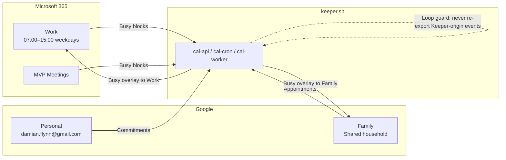
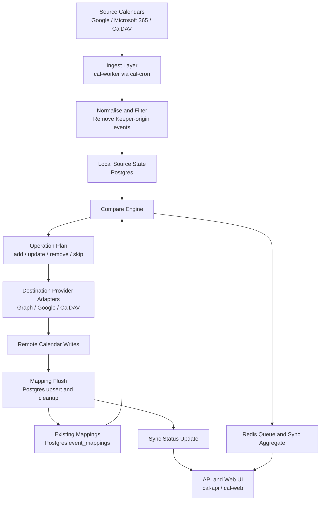
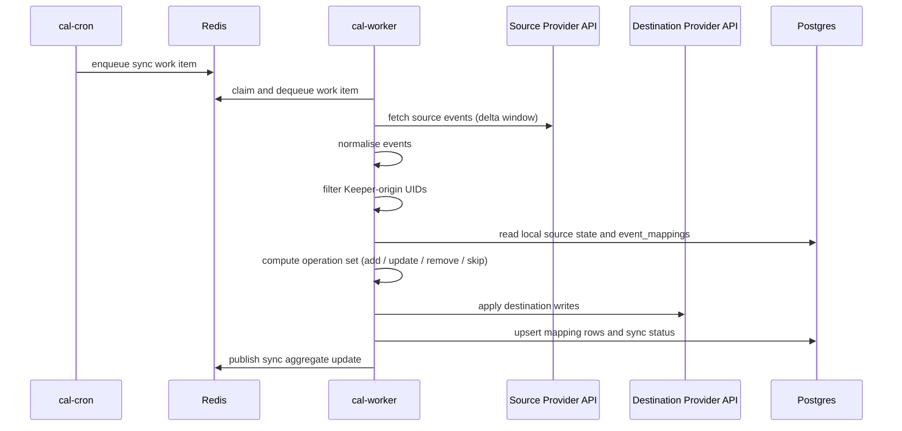

# Self-Hosting Keeper.sh: A Deep Dive into Cross-Provider Calendar Synchronisation

> **Stack version:** Keeper 2.9 · Postgres 17 · Redis 7 · Traefik (external proxy)  
> **Host:** LXC `100` (`selfhost`) at `172.16.1.159`  
> **Compose:** [`stacks/selfhosted/keeper-sh/compose.yaml`](compose.yaml)

---

## The Problem Worth Solving

Anyone who has tried to keep more than one calendar in sync across Microsoft 365 and Google knows the specific kind of frustration that builds over time. It starts small — a work meeting that should have blocked family time, a dentist appointment that nobody knew clashed with a school pick-up. You patch it with a Power Automate flow or an n8n workflow. It works for a while. Then the edge cases arrive.

Delta sync tokens behave differently between Microsoft Graph and Google Calendar. Event identity is not portable across providers. Recurrence exceptions — the single-occurrence override inside a recurring series — arrive as a different payload type than their parent, and pipeline tools that do not understand the distinction silently drop them. Most critically, bidirectional sync rules without rigorous event origin tagging create feedback loops that can flood calendars with duplicate busy blocks, each of which dutifully propagates again on the next run.

By the time this stack was built, the legacy flows had accumulated three independent workarounds for loop prevention, none of which were provably correct, and sync drift had become a normal operational state rather than an exception.

[Keeper.sh](https://keeper.sh) is not a general-purpose automation platform. It is a purpose-built calendar synchronisation engine. It maintains persistent mapping state in Postgres, coordinates work across a queue in Redis, and applies deterministic origin tagging to every event it creates. This document explains the specific deployment of Keeper in this self-hosted stack, how it is configured, and exactly how its internal machinery handles the correctness guarantees that pipeline tools cannot easily provide.

---

## The Calendar Topology

Before the architecture, the business context: this deployment synchronises five calendars across two Microsoft 365 accounts and two Google accounts belonging to members of the same household. The goal is one-way propagation of busy-time information across the work/personal/family boundary without exposing event details.

| Calendar | Provider | Description |
|---|---|---|
| Work | Microsoft 365 | Primary work schedule, weekdays, meetings and workshops |
| MVP Meetings | Microsoft 365 | Additional work-related commitments, community and advisory |
| Family | Google | Shared household calendar — partner and kids activities |
| Personal | Google (`damian.flynn@gmail.com`) | Private commitments — medical, personal meetings |

The sync rules are all one-directional. There is no merge operation, no conflict resolution, and no bidirectional edge:

| Source | Destination | What is propagated |
|---|---|---|
| Work | Family | Busy blocks so family scheduling avoids work commitments |
| MVP Meetings | Family | Busy blocks for community commitments |
| Family | Work | Family appointments as unavailable time in Work |
| Personal | Family | Personal commitments for household conflict visibility |
| Personal | Work | Personal commitments as unavailable time in Work |

Visualised as a directed graph, the topology looks like this:



A few policy decisions are worth making explicit now because they come up again when reading the implementation:

**Privacy.** Destination calendars receive only free/busy time blocks. No event subject, no description, no attendees. The cross-domain sync edges in this topology — particularly the Personal → Work and Personal → Family edges — should not expose medical or private appointment titles.

**Source authority.** The source calendar wins, unconditionally. If a synced busy block is edited or deleted in the destination, Keeper overwrites the change on the next cycle.

**Deletion propagation.** Deleting a source event removes the corresponding destination busy block on the following cycle. The mapping row is cleaned up.

**Timezone normalisation.** All operations normalise to `Europe/Dublin` as the canonical zone. This prevents DST boundary drift where events fall on different local days depending on which provider reads them.

**Work-hours gate.** Family and personal events outside business hours still write busy blocks into the Work calendar. Keeper does not gate on working-hours boundaries — the assumption is that the user prefers to see all conflicts.

---

## The Engine: Pull, Compare, Push

What distinguishes Keeper from a simple event-copy pipeline is the separation between ingest, comparison, and write-back, mediated by persistent state at each stage.

### Phase 1: Ingestion

The `cal-cron` container generates work items on a schedule. `cal-worker` consumes each item from the Redis queue and begins a sync cycle for a given source-to-destination rule. The first step is fetching source events from the provider API — Microsoft Graph for M365 calendars, Google Calendar API for Google accounts, or raw HTTP for CalDAV/ICS sources.

Keeper does not fetch all events on every cycle. It uses delta tokens and change-tracking mechanisms where the provider supports them. The raw provider payloads are then normalised into a shared Keeper event model that abstracts over the differences between Google's `iCalUID` convention, Graph's `iCalUId` behaviour, and CalDAV UID semantics.

Critically — and this is covered in more detail in the next section — the normalisation step includes filtering out events that Keeper itself created. This is the primary loop-prevention mechanism.

### Phase 2: Compare

After normalising the inbound event set, Keeper reads the existing local source state and the mapping table from Postgres. The comparison engine computes a set of operations:

- Events in the source with no mapping record: schedule a **create** in the destination.
- Events with a mapping record where the source content hash has changed: schedule an **update** (stale mapping).
- Events that were previously mapped but whose source event is now gone: schedule a **remove** in the destination.
- Events with a mapping record and a matching hash: **no operation** — already synced, skip.

This comparison logic is what makes the sync correct across restarts, provider outages, and partial failures. It does not rely on in-memory state, timestamps, or guessing — it is purely the relationship between the normalised source event and the persisted mapping row.

### Phase 3: Apply

With the operation set computed, `cal-worker` drives writes to the destination provider. New events are created. Stale events are updated in-place using the destination event identifier stored in the mapping. Orphaned mappings are cleaned up, and the worker issues deletes to the destination for any removed source events.

After successful writes, the mapping table is updated — new rows inserted, stale rows updated, removed rows deleted. The sync status aggregate is then published to Redis so the API and web UI can surface per-rule health.



---

## How Keeper Prevents Sync Loops

This is the section most relevant to anyone who has burned time debugging cross-provider sync loops. Keeper's loop prevention is not ad-hoc — it is implemented at two levels.

### Level 1: UID Tagging

Every event Keeper creates at a destination gets a UID that includes the `@keeper.sh` suffix. This is applied consistently regardless of provider. When Keeper subsequently fetches source events for any calendar, the ingest layer checks the UID of each event before normalising it. Events with UIDs matching the `@keeper.sh` pattern are recognised as Keeper-origin and excluded from the ingest payload.

The practical consequence: a busy block written by Keeper into the Work calendar will never be picked up by the "Work → Family" ingestion pass. The event is explicitly filtered before it even reaches the normalisation and compare stages.

### Level 2: Mapping State

The UID tag is the runtime guard. The mapping table is the state guard. Even if UID matching ever failed — due to a provider rewriting UIDs, for example — the mapping row for a Keeper-created destination event tells the compare engine that this destination event already corresponds to a specific source event. The compare logic would see an existing, non-stale mapping and emit no re-create operation.

The two mechanisms are complementary. UID filtering prevents Keeper-origin events from entering the ingest pipeline. Mapping state prevents already-handled source events from being processed again. Together they make the sync idempotent by construction.

---

## Mapping State: The Heart of Correct Sync

The `event_mappings` table in Postgres is what separates Keeper from a stateless event-copy job. Each row represents a resolved relationship between a source event and a destination event across a specific sync rule.

The key fields in the mapping model are:

- **Source local state identifier** — references the normalised source event as known to Keeper.
- **Destination event UID** — the UID of the event Keeper created or manages in the destination calendar.
- **Sync event hash** — a SHA-256 content hash of the source event's relevant fields at the time of the last successful sync write.
- **Start and end timestamps** — used for windowed query operations and stale detection relative to time-based cleanups.

A uniqueness constraint on the combination of source mapping context and destination context prevents duplicate mapping rows for the same logical pair. The `onConflictDoNothing()` insertion pattern in the worker means that idempotent re-runs do not corrupt mapping state.

The `syncEventHash` value is the stale detection mechanism. When the compare engine reads a mapping row, it computes the current source event's content hash and compares it to the stored value. If they differ, the event has changed since the last sync and Keeper schedules an update of the destination event. If they match, no write is needed.

There is also a `source_destination_mappings` table that tracks which sources feed which destinations under which rule configurations. This is the routing layer. The `event_mappings` table is the per-event state layer. Together they give Keeper the complete picture of what has been synced, to where, and whether it is current.

---

## The Six Containers

This stack runs six Docker services connected by a `keeper` bridge network and exposed to the outside world through Traefik on the `t3_proxy` external network.

```
  +------------------------------------------------------------+
  |  t3_proxy (external — Traefik)                             |
  |     |                                                       |
  |  keeper.DOMAIN -------> cal-web:3000                       |
  |  keeper-api.DOMAIN ----> cal-api:3001                      |
  +------------------------------------------------------------+
                        |
  +---------------------+--------------------------------------+
  |  keeper bridge network                                      |
  |                                                             |
  |  cal-web ----> cal-api ----> cal-postgres                  |
  |                    +------> cal-redis                      |
  |  cal-cron ----> cal-redis <-- cal-worker                   |
  |  cal-worker ----> cal-postgres                             |
  |  cal-worker ----> [external provider APIs]                 |
  +-------------------------------------------------------------+
```

**`cal-postgres`** (`postgres:17`) — persistent state storage. Holds credentials metadata, normalised source event state, mapping tables, and sync status. Data lives at `/mnt/fast/appdata/automation/keeper/postgres`. This is the recovery-critical volume: if it is lost, all mapping state and account connections are gone.

**`cal-redis`** (`redis:7-alpine`) — work queue and ephemeral aggregate state. `cal-cron` publishes sync work items here. `cal-worker` consumes them. Sync status aggregates for UI display are staged here. Data lives at `/mnt/fast/appdata/automation/keeper/redis`. Redis state is reconstructable from Postgres on restart but losing it mid-cycle can cause in-flight jobs to be re-queued.

**`cal-api`** (`ghcr.io/ridafkih/keeper-api:2.9`) — control plane. Handles OAuth callback flows for Google and Microsoft, manages account and mapping configuration, and serves the data layer consumed by the web UI. Bound to `127.0.0.1:3001` locally; exposed externally only via Traefik with HTTPS.

**`cal-cron`** (`ghcr.io/ridafkih/keeper-cron:2.9`) — scheduler. Generates sync work items at configured intervals and publishes them to the Redis queue. Has no publicly exposed port. Failure here means sync stops scheduling; already in-flight or already-queued work still runs.

**`cal-worker`** (`ghcr.io/ridafkih/keeper-worker:2.9`) — execution plane. The heart of the sync engine. Consumes work from Redis, drives the pull-compare-push cycle, writes to destination provider APIs, and posts mapping and status updates back to Postgres. Has no publicly exposed port. All correctness guarantees live in this container's logic.

**`cal-web`** (`ghcr.io/ridafkih/keeper-web:2.9`) — UI. Used for account connection, mapping rule configuration, and operational health visibility. Bound to `127.0.0.1:3000` locally; exposed externally via Traefik with HTTPS.

---

## Configuration and Secrets

The stack is configured through a `.env` file co-located with the compose definition. No secrets are baked into images or compose files. The categories are:

**Core secrets — handle with extreme care:**

```bash
POSTGRES_PASSWORD=          # Keeper's Postgres database password
BETTER_AUTH_SECRET=         # Session signing key for cal-api auth
ENCRYPTION_KEY=             # Symmetric key for stored provider credential encryption
```

`ENCRYPTION_KEY` is the most critical value in the whole deployment. It wraps the Google and Microsoft OAuth tokens stored in Postgres. If this key changes and the old value is not available, all stored provider connections become unreadable. Rotate only with a full credential re-authentication plan in place.

**OAuth provider credentials:**

```bash
GOOGLE_CLIENT_ID=
GOOGLE_CLIENT_SECRET=
MICROSOFT_CLIENT_ID=
MICROSOFT_CLIENT_SECRET=
```

These must match the registered OAuth application in Google Cloud Console and Azure Entra respectively. The redirect URIs registered there must exactly match the callback URLs Keeper expects at `keeper-api.DOMAINNAME`.

**URL and origin controls:**

```bash
WEBSOCKET_URL=              # Public WebSocket endpoint for real-time UI updates
BETTER_AUTH_URL=            # Public URL of the API (used in auth redirect generation)
TRUSTED_ORIGINS=            # Comma-separated list of origins allowed to call cal-api
```

`TRUSTED_ORIGINS` is a CSRF surface. Set it to exactly the origins that the web UI runs on and nothing else.

---

## A Complete Sync Cycle, End to End

The sequence below traces a single sync cycle from scheduler tick to mapping flush. This is the canonical path for a source event that exists, has not changed, and is already mapped:



For an already-synced event with an unchanged hash, the path is identical up to "compute operation set" — and then the destination write and mapping upsert are simply omitted. The cycle completes with only a status update.

---

## Provider-Specific Behaviour

### Google Calendar

Google's `iCalUID` is generally stable and portable. Keeper uses it as the primary correlation handle on the source side for Google accounts. Delta sync uses the Google Calendar API's `syncToken` mechanism where available, falling back to time-window queries. The Keeper-origin filter checks `iCalUID` for the `@keeper.sh` suffix before the event enters normalisation.

The `damian.flynn@gmail.com` and `Damian.Flynn@gmail.com` case difference is handled at the Google account level — both resolve to the same OAuth principal. Keeper treats the account connection as a single identity.

### Microsoft Graph (Outlook / M365)

Microsoft's `iCalUId` value in Graph responses behaves differently from Google's: it is not always a clean iCal UID, and its format varies across meeting types (regular appointments, Teams meetings, recurring series, and cancellations). Keeper's Outlook adapter normalises around this, and the loop guard uses both the suffix convention and a Keeper-specific category marker on destination events as a belt-and-braces approach.

Recurring series are handled at the series level where possible. Individual exception instances arrive as separate payloads in Graph and are processed per-occurrence, which can create edge cases around multi-exception series — notably where a series has both a moved occurrence and a cancellation exception. These scenarios should be validated after any image upgrade.

### CalDAV and ICS

CalDAV sources use UID-based identity with ETag-level change detection where the server supports it. The UID suffix filter applies here exactly as it does for Graph and Google. ICS poll sources use full-refresh semantics — there is no delta mechanism — which increases the importance of hash-based stale detection to avoid unnecessary destination rewrites.

---

## Operating This Stack

### Starting and Updating

All operations run from the repo root on the target host (`172.16.1.159`):

```bash
# Pull updated images
docker compose -f stacks/selfhosted/keeper-sh/compose.yaml pull

# Recreate services with new images
docker compose -f stacks/selfhosted/keeper-sh/compose.yaml up -d

# Verify all six services are running
docker compose -f stacks/selfhosted/keeper-sh/compose.yaml ps
```

### Checking Health

```bash
# Service status at a glance
docker ps --format "table {{.Names}}\t{{.Status}}\t{{.Image}}" | grep cal-

# Database readiness
docker exec cal-postgres pg_isready -U keeper -d keeper

# Redis readiness
docker exec cal-redis redis-cli ping

# API and web reachable through Traefik
curl -sI https://keeper-api.<your-domain>/health
curl -sI https://keeper.<your-domain>
```

### Reading Logs

The most useful log pair during live triage is `cal-cron` and `cal-worker`. `cal-cron` tells you whether work is being scheduled; `cal-worker` tells you whether that work is being consumed and whether provider calls are succeeding:

```bash
# Watch work item generation
docker logs cal-cron --tail=200 -f

# Watch sync execution
docker logs cal-worker --tail=200 -f

# API issues (auth, token refresh, mapping queries)
docker logs cal-api --tail=200 -f
```

A healthy production log stream shows `cal-cron` emitting work items every few minutes, `cal-worker` consuming them, and a mix of already-synced skips and occasional writes when events change.

---

## When Things Go Wrong

### Suspected Sync Loop

**Symptoms:** Rapid event proliferation. Destination calendars fill with duplicate busy blocks. Worker log shows repeated create operations for the same time windows.

**Diagnosis:** Inspect destination events directly — do they carry the `@keeper.sh` UID suffix? Check `cal-worker` logs for the specific mapping being processed. Query Postgres for abnormally high row growth in `event_mappings`. If events created by Keeper are appearing in source ingest payloads, the UID filter is not firing correctly.

**Resolution:** Pause the offending mapping rule in the UI, clean up destination duplicates manually, then re-enable after confirming the UID filter operates on the specific source account being used.

### Drift Without Errors

**Symptoms:** Destination calendar is missing events that should have synced. Worker logs appear healthy. UI shows in-sync.

**Note on in-sync:** The in-sync indicator in the Keeper UI is derived from count parity between `localEventCount` and `remoteEventCount`. Count parity is a coarse operational signal — it does not prove semantic correctness. A suppressed event and a spurious event can cancel each other out and leave the count showing parity while the content is wrong.

**Diagnosis:** Identify a specific event that should be synced. Check whether a mapping row exists for it in `event_mappings`. Check the stored hash against the current source event content. Validate whether the source event is being excluded by the Keeper-origin filter (i.e., does it have `@keeper.sh` in its UID?).

**Resolution:** Dependent on the specific cause. If the event is being wrongly filtered as Keeper-origin, the UID convention has leaked into a non-Keeper event — investigate how that event was created. If the mapping row exists but the destination event is absent, a manual trigger of the sync rule should recreate it.

### OAuth Token Failures

**Symptoms:** Worker logs show authentication or authorization failures for Google or Microsoft. Affected mappings stop producing writes. UI may prompt for reauthorisation.

**Diagnosis:** Check `cal-api` logs for 401 or 403 responses from provider APIs. Verify `GOOGLE_CLIENT_ID`, `GOOGLE_CLIENT_SECRET`, `MICROSOFT_CLIENT_ID`, and `MICROSOFT_CLIENT_SECRET` in `.env` match the registered OAuth applications. Verify `BETTER_AUTH_URL` and callback URIs are correct.

**Resolution:** In most cases, opening the Keeper web UI and reconnecting the affected account will refresh the OAuth tokens. If the OAuth application registration itself has changed, update the relevant env vars and restart `cal-api` before reconnecting.

### Queue Backlog

**Symptoms:** Sync latency increases. Events changed in a source calendar are slow to appear in the destination.

**Diagnosis:** `docker exec cal-redis redis-cli llen <queue-key>` to inspect queue depth. Check `cal-worker` resource usage. Look for long-running provider API calls in worker logs — rate limiting or slow responses from Google or Microsoft are common causes during their maintenance windows.

**Resolution:** If the queue is deep due to a transient provider slowdown, allow it to drain naturally. If worker resource usage is the bottleneck, consider the container resource limits in the compose definition.

---

## Validating Sync Correctness

After any significant change — image upgrade, credential rotation, new mapping rule — run this validation sequence:

**One-way propagation test.** Create a test event in a source calendar. Wait one sync cycle. Confirm the event appears in the destination. Confirm a mapping row exists in Postgres.

**Idempotency test.** Without changing the source event, wait for another sync cycle to complete. Confirm no duplicate is created in the destination. Confirm the mapping row was not duplicated.

**Update propagation test.** Change the title or time of the source event. Wait one cycle. Confirm the destination event is updated in-place — not recreated. Confirm the mapping row's `syncEventHash` has been updated.

**Deletion propagation test.** Delete the source test event. Wait one cycle. Confirm the destination event is removed. Confirm the mapping row is cleaned up.

**Loop guard test.** Confirm the destination event created in the propagation test does not subsequently appear as a source event to be processed on the next cycle for any rule that reads the destination calendar.

**Recurrence test.** Create a recurring event in a source calendar. Move one occurrence. Confirm the exception is handled without duplicating the series in the destination.

---

## Backup and Recovery

The minimum recovery set for this stack is:

1. **Postgres volume** at `/mnt/fast/appdata/automation/keeper/postgres` — contains all credentials metadata, source event state, and mapping tables.
2. **`.env` file** — contains the `ENCRYPTION_KEY` that wraps stored OAuth tokens. Without this key, restoring the Postgres volume produces an unusable credential store.
3. **Compose definition** — the service configuration and Traefik labels.

The Redis volume contains ephemeral queue and aggregate state. It does not need to be in the backup rotation — it can be safely wiped and will rebuild from Postgres state after a restart.

Recovery procedure:

```bash
# 1. Restore the Postgres data directory
rsync -a /backup/keeper/postgres/ /mnt/fast/appdata/automation/keeper/postgres/

# 2. Restore .env with matching ENCRYPTION_KEY
cp /backup/keeper/.env stacks/selfhosted/keeper-sh/.env

# 3. Start services
docker compose -f stacks/selfhosted/keeper-sh/compose.yaml up -d

# 4. Validate DB connectivity
docker exec cal-postgres pg_isready -U keeper -d keeper

# 5. Open UI and confirm account connections are healthy
# 6. Trigger a manual sync cycle and validate output
```

---

## Upgrade Procedure

```bash
# 1. Snapshot Postgres before the upgrade
docker exec cal-postgres pg_dump -U keeper keeper > /backup/keeper/pre-upgrade-$(date +%Y%m%d).sql

# 2. Pull updated images
docker compose -f stacks/selfhosted/keeper-sh/compose.yaml pull

# 3. Recreate services
docker compose -f stacks/selfhosted/keeper-sh/compose.yaml up -d

# 4. Watch for migration warnings
docker logs cal-worker --tail=100
docker logs cal-api --tail=100

# 5. Run the validation sequence above
```

Check Keeper upstream release notes for any changes to sync semantics, mapping table schema, or provider adapter behaviour before applying minor or major version bumps.

---

## Appendix: Quick Reference

### Service Summary

| Service | Image | Role |
|---|---|---|
| `cal-postgres` | `postgres:17` | Persistent state — mappings, credentials, sync status |
| `cal-redis` | `redis:7-alpine` | Work queue and sync aggregate state |
| `cal-api` | `keeper-api:2.9` | Control plane API, OAuth, data queries |
| `cal-cron` | `keeper-cron:2.9` | Sync job scheduler |
| `cal-worker` | `keeper-worker:2.9` | Sync execution engine |
| `cal-web` | `keeper-web:2.9` | Web UI |

### Environment Variables

| Variable | Purpose | Rotation risk |
|---|---|---|
| `POSTGRES_PASSWORD` | DB auth | Medium — requires compose restart |
| `BETTER_AUTH_SECRET` | Session signing | Medium — invalidates active sessions |
| `ENCRYPTION_KEY` | OAuth token wrapping | **Critical** — invalidates all stored credentials |
| `GOOGLE_CLIENT_ID/SECRET` | Google OAuth | Low — update and restart cal-api |
| `MICROSOFT_CLIENT_ID/SECRET` | M365 OAuth | Low — update and restart cal-api |
| `TRUSTED_ORIGINS` | CSRF guard | Low — keep minimal and exact |

### Sync Rules at a Glance

| Source | Destination | Content published |
|---|---|---|
| Work (M365) | Family (Google) | Busy blocks, no details |
| MVP Meetings (M365) | Family (Google) | Busy blocks, no details |
| Family (Google) | Work (M365) | Busy/unavailable, no details |
| Personal (Google) | Family (Google) | Busy blocks, no details |
| Personal (Google) | Work (M365) | Busy/unavailable, no details |

### Repository Files

- [`stacks/selfhosted/keeper-sh/compose.yaml`](compose.yaml) — service definitions and network config
- [`CLAUDE.md`](../../../CLAUDE.md) — repo-wide conventions and platform context
