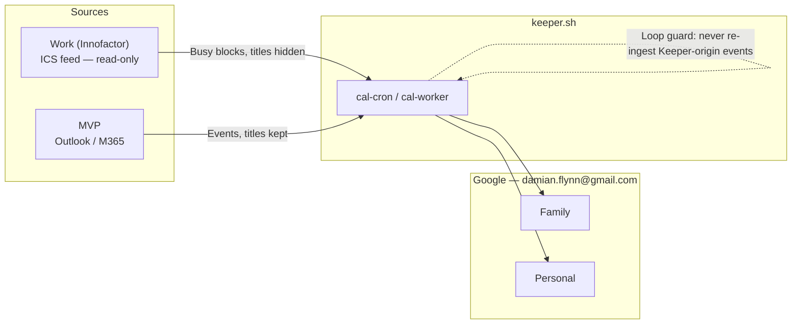
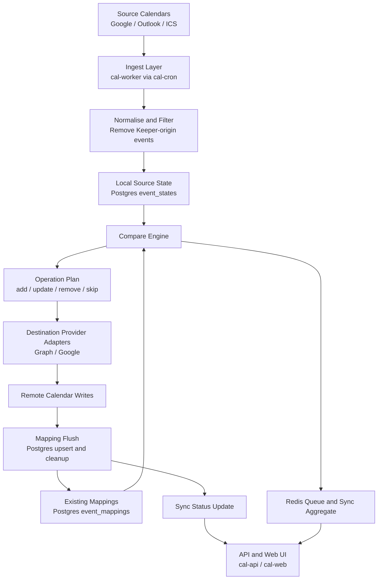
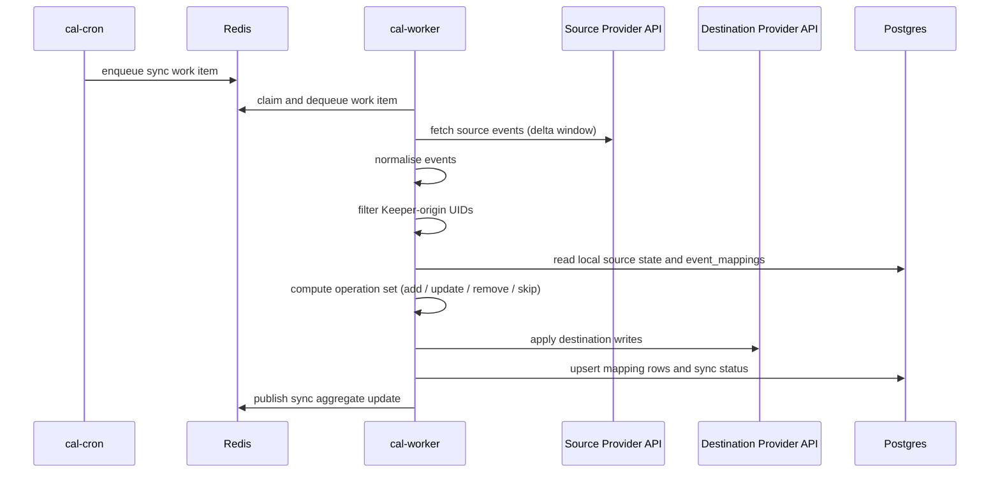

# Self-Hosting Keeper.sh: A Deep Dive into Cross-Provider Calendar Synchronisation

> **Stack version:** Keeper 2.23 · Postgres 18 · Redis 7 · Traefik (external proxy)
> **Host:** LXC `100` (`selfhost`) at `172.16.1.159`
> **Compose:** [`stacks/selfhosted/keeper-sh/compose.yaml`](compose.yaml)
> **Last verified against live state:** 2026-09-02

---

## The Problem Worth Solving

Anyone who has tried to keep more than one calendar in sync across Microsoft 365 and Google knows the specific kind of frustration that builds over time. It starts small — a work meeting that should have blocked family time, a dentist appointment that nobody knew clashed with a school pick-up. You patch it with a Power Automate flow or an n8n workflow. It works for a while. Then the edge cases arrive.

Delta sync tokens behave differently between Microsoft Graph and Google Calendar. Event identity is not portable across providers. Recurrence exceptions — the single-occurrence override inside a recurring series — arrive as a different payload type than their parent, and pipeline tools that do not understand the distinction silently drop them. Most critically, bidirectional sync rules without rigorous event origin tagging create feedback loops that can flood calendars with duplicate busy blocks, each of which dutifully propagates again on the next run.

By the time this stack was built, the legacy flows had accumulated three independent workarounds for loop prevention, none of which were provably correct, and sync drift had become a normal operational state rather than an exception.

[Keeper.sh](https://keeper.sh) is not a general-purpose automation platform. It is a purpose-built calendar synchronisation engine. It maintains persistent mapping state in Postgres, coordinates work across a queue in Redis, and applies deterministic origin tagging to every event it creates. This document explains the specific deployment of Keeper in this self-hosted stack, how it is configured, and exactly how its internal machinery handles the correctness guarantees that pipeline tools cannot easily provide.

---

## The Calendar Topology

Before the architecture, the business context: this deployment synchronises **seven calendars across three connected accounts**. The goal is one-way propagation of busy-time information from the work side into the personal/family side, without exposing event details.

### Connected accounts

| Account | Provider | Auth | Connected |
|---|---|---|---|
| `damian.flynn@gmail.com` | Google | OAuth | 2026-03-18 |
| `Technology@damianflynn.com` | Outlook / M365 | OAuth | 2026-03-18 |
| Work (Innofactor) | **ICS feed** | **none** | 2026-08-11 |

**The Work calendar is an ICS subscription, not an M365 OAuth connection.** It arrives as a published OWA busy-only `calendar.ics` URL on the `innofactor.com` tenant, because Entra app consent was not available on that tenant. This single fact determines the entire shape of the sync topology — see below.

### Calendars

| Calendar | Account | Title privacy | Destination title |
|---|---|---|---|
| `damian.flynn@gmail.com` (Personal) | Google | titles kept | `{{event_name}}` |
| `Family` | Google | titles kept | `{{event_name}}` |
| `Holidays in Ireland` | Google | titles hidden | `{{calendar_name}}` |
| `Work (Innofactor)` | ICS | **titles hidden** | `{{calendar_name}}` |
| `MVP` | Outlook | **titles kept** | `{{event_name}}` |
| `Birthdays` | Outlook | titles hidden | `{{calendar_name}}` |
| `United Kingdom holidays` | Outlook | titles hidden | `{{calendar_name}}` |

All seven are enabled and included in the iCal feed.

### Sync rules

There are **four** rules. All are one-directional. There is no merge operation, no conflict resolution, and no bidirectional edge:

| Source | Destination | Created |
|---|---|---|
| Work (Innofactor) | Personal (`damian.flynn@gmail.com`) | 2026-08-11 |
| Work (Innofactor) | Family | 2026-08-11 |
| MVP | Personal (`damian.flynn@gmail.com`) | 2026-03-18 |
| MVP | Family | 2026-03-18 |

**Nothing writes back into Work.** This is not a policy choice that could be reversed by adding a rule — it is structural. An ICS subscription is a read-only HTTP fetch; Keeper has no credential and no protocol with which to create an event there. Any design that needs family or personal commitments to appear as busy time inside the work calendar requires replacing the ICS feed with a real M365 OAuth connection first.

Visualised as a directed graph, the topology looks like this:


```mermaid
flowchart LR
    subgraph Sources["Sources"]
        W["Work (Innofactor)<br/>ICS feed — read-only"]
        M["MVP<br/>Outlook / M365"]
    end

    subgraph Google["Google — damian.flynn@gmail.com"]
        F["Family"]
        P["Personal"]
    end

    subgraph Engine["keeper.sh"]
        K["cal-cron / cal-worker"]
    end

    W -->|"Busy blocks, titles hidden"| K
    M -->|"Events, titles kept"| K

    K --> F
    K --> P

    K -. "Loop guard: never re-ingest Keeper-origin events" .-> K
```

A few policy decisions are worth making explicit now because they come up again when reading the implementation:

**Privacy is per-source-calendar, not global.** Each calendar carries its own `excludeEventName` and `customEventName` setting, and they are not uniform:

- `Work (Innofactor)` has `excludeEventName=true` with `customEventName={{calendar_name}}` — destination events read "Work (Innofactor)". Subjects, descriptions and attendees do not cross.
- **`MVP` has `excludeEventName=false` with `customEventName={{event_name}}` — real MVP event titles propagate into both Family and Personal.**

If MVP titles should be hidden too, that is a per-calendar setting change in the UI, not a code or compose change.

**Source authority.** The source calendar wins, unconditionally. If a synced busy block is edited or deleted in the destination, Keeper overwrites the change on the next cycle.

**Deletion propagation.** Deleting a source event removes the corresponding destination busy block on the following cycle. The mapping row is cleaned up.

**Timezone normalisation.** All operations normalise to `Europe/Dublin` as the canonical zone. This prevents DST boundary drift where events fall on different local days depending on which provider reads them.

---

## The Engine: Pull, Compare, Push

What distinguishes Keeper from a simple event-copy pipeline is the separation between ingest, comparison, and write-back, mediated by persistent state at each stage.

### Phase 1: Ingestion

The `cal-cron` container generates work items on a schedule — currently **every 60 seconds**. `cal-worker` consumes each item from the Redis queue and begins a sync cycle for a given source-to-destination rule. The first step is fetching source events from the provider API — Microsoft Graph for the Outlook account, Google Calendar API for the Google account, or a plain HTTP fetch for the ICS feed.

Keeper does not fetch all events on every cycle. It uses delta tokens and change-tracking mechanisms where the provider supports them. ICS has no delta mechanism, so that source is a full refresh each time. The raw provider payloads are then normalised into a shared Keeper event model that abstracts over the differences between Google's `iCalUID` convention, Graph's `iCalUId` behaviour, and ICS UID semantics.

Critically — and this is covered in more detail in the next section — the normalisation step includes filtering out events that Keeper itself created. This is the primary loop-prevention mechanism.

### Phase 2: Compare

After normalising the inbound event set, Keeper reads the existing local source state and the mapping table from Postgres. The comparison engine computes a set of operations:

- Events in the source with no mapping record: schedule a **create** in the destination.
- Events with a mapping record where the source content hash has changed: schedule an **update** (stale mapping).
- Events that were previously mapped but whose source event is now gone: schedule a **remove** in the destination.
- Events with a mapping record and a matching hash: **no operation** — already synced, skip.

This comparison logic is what makes the sync correct across restarts, provider outages, and partial failures. It does not rely on in-memory state, timestamps, or guessing — it is purely the relationship between the normalised source event and the persisted mapping row.

### Phase 3: Apply

With the operation set computed, `cal-worker` drives writes to the destination provider. New events are created. Stale events are updated in-place using the destination event identifier stored in the mapping. Orphaned mappings are cleaned up, and the worker issues deletes to the destination for any removed source events.

After successful writes, the mapping table is updated — new rows inserted, stale rows updated, removed rows deleted. The sync status aggregate is then published to Redis so the API and web UI can surface per-rule health.


```mermaid
flowchart TB
    A["Source Calendars<br/>Google / Outlook / ICS"] --> B["Ingest Layer<br/>cal-worker via cal-cron"]
    B --> C["Normalise and Filter<br/>Remove Keeper-origin events"]
    C --> D["Local Source State<br/>Postgres event_states"]
    D --> E["Compare Engine"]
    F["Existing Mappings<br/>Postgres event_mappings"] --> E
    E --> G["Operation Plan<br/>add / update / remove / skip"]
    G --> H["Destination Provider Adapters<br/>Graph / Google"]
    H --> I["Remote Calendar Writes"]
    I --> J["Mapping Flush<br/>Postgres upsert and cleanup"]
    J --> F
    J --> K["Sync Status Update"]
    K --> L["API and Web UI<br/>cal-api / cal-web"]
    M["Redis Queue and Sync Aggregate"] --> L
    E --> M
```

---

## How Keeper Prevents Sync Loops

This is the section most relevant to anyone who has burned time debugging cross-provider sync loops. Keeper's loop prevention is not ad-hoc — it is implemented at two levels.

### Level 1: UID Tagging

Every event Keeper creates at a destination gets a UID that includes the `@keeper.sh` suffix. This is applied consistently regardless of provider. When Keeper subsequently fetches source events for any calendar, the ingest layer checks the UID of each event before normalising it. Events with UIDs matching the `@keeper.sh` pattern are recognised as Keeper-origin and excluded from the ingest payload.

The practical consequence: a busy block written by Keeper into Family will never be picked up as a source event by any rule that reads Family. The event is explicitly filtered before it even reaches the normalisation and compare stages.

### Level 2: Mapping State

The UID tag is the runtime guard. The mapping table is the state guard. Even if UID matching ever failed — due to a provider rewriting UIDs, for example — the mapping row for a Keeper-created destination event tells the compare engine that this destination event already corresponds to a specific source event. The compare logic would see an existing, non-stale mapping and emit no re-create operation.

The two mechanisms are complementary. UID filtering prevents Keeper-origin events from entering the ingest pipeline. Mapping state prevents already-handled source events from being processed again. Together they make the sync idempotent by construction.

In this deployment the loop risk is structurally low anyway: the two destinations (Family, Personal) are never also sources, so there is no cycle in the graph to close.

---

## Mapping State: The Heart of Correct Sync

The `event_mappings` table in Postgres is what separates Keeper from a stateless event-copy job. Each row represents a resolved relationship between a source event and a destination event across a specific sync rule. As of 2026-09-02 this deployment holds **934 mappings over 1,676 event states** — a point-in-time reading, not a fixed figure.

The key fields in the mapping model are:

- **Source local state identifier** — references the normalised source event as known to Keeper.
- **Destination event UID** — the UID of the event Keeper created or manages in the destination calendar.
- **Sync event hash** — a SHA-256 content hash of the source event's relevant fields at the time of the last successful sync write.
- **Start and end timestamps** — used for windowed query operations and stale detection relative to time-based cleanups.

A uniqueness constraint on the combination of source mapping context and destination context prevents duplicate mapping rows for the same logical pair. The `onConflictDoNothing()` insertion pattern in the worker means that idempotent re-runs do not corrupt mapping state.

The `syncEventHash` value is the stale detection mechanism. When the compare engine reads a mapping row, it computes the current source event's content hash and compares it to the stored value. If they differ, the event has changed since the last sync and Keeper schedules an update of the destination event. If they match, no write is needed.

There is also a `source_destination_mappings` table that tracks which sources feed which destinations. This is the routing layer — it holds the four rows listed under "Sync rules" above. The `event_mappings` table is the per-event state layer. Together they give Keeper the complete picture of what has been synced, to where, and whether it is current.

---

## The Seven Containers

This stack runs seven Docker services connected by a `keeper` bridge network and exposed to the outside world through Traefik on the `t3_proxy` external network.

```
  +------------------------------------------------------------+
  |  t3_proxy (external — Traefik)                              |
  |     |                                                       |
  |  keeper.DOMAIN -------> cal-web:3000  (also serves /mcp)    |
  |  keeper-api.DOMAIN ----> cal-api:3001                       |
  +------------------------------------------------------------+
                        |
  +---------------------+--------------------------------------+
  |  keeper bridge network                                      |
  |                                                             |
  |  cal-web ----> cal-api ----> cal-postgres                   |
  |      |             +------> cal-redis                       |
  |      +-------> cal-mcp ----> cal-postgres                   |
  |                    +-------> cal-api                        |
  |  cal-cron ----> cal-redis <-- cal-worker                    |
  |  cal-worker ----> cal-postgres                              |
  |  cal-worker ----> [external provider APIs]                  |
  +-------------------------------------------------------------+
```

**`cal-postgres`** (`postgres:18`) — persistent state storage. Holds credentials metadata, normalised source event state, mapping tables, API token hashes, and sync status. Data lives at `/mnt/fast/appdata/automation/keeper/postgres`. This is the recovery-critical volume: if it is lost, all mapping state and account connections are gone.

**`cal-redis`** (`redis:7-alpine`) — work queue and ephemeral aggregate state. `cal-cron` publishes sync work items here. `cal-worker` consumes them. Sync status aggregates for UI display are staged here. Data lives at `/mnt/fast/appdata/automation/keeper/redis`. Redis state is reconstructable from Postgres on restart but losing it mid-cycle can cause in-flight jobs to be re-queued.

**`cal-api`** (`ghcr.io/ridafkih/keeper-api:2.23`) — control plane. Handles OAuth callback flows for Google and Microsoft, manages account and mapping configuration, serves the `/api/v1` REST surface, and acts as the OAuth authorisation server for MCP. Bound to `127.0.0.1:3001` locally; exposed externally only via Traefik with HTTPS.

**`cal-cron`** (`ghcr.io/ridafkih/keeper-cron:2.23`) — scheduler. Generates sync work items every 60 seconds and publishes them to the Redis queue. Has no publicly exposed port. Failure here means sync stops scheduling; already in-flight or already-queued work still runs.

**`cal-worker`** (`ghcr.io/ridafkih/keeper-worker:2.23`) — execution plane. The heart of the sync engine. Consumes work from Redis, drives the pull-compare-push cycle, writes to destination provider APIs, and posts mapping and status updates back to Postgres. Has no publicly exposed port. All correctness guarantees live in this container's logic.

**`cal-mcp`** (`ghcr.io/ridafkih/keeper-mcp:2.23`) — MCP server. Serves the Model Context Protocol endpoint that AI clients connect to. Has no publicly exposed port and no Traefik labels by design — `cal-web` proxies `/mcp` to it, the same way it proxies `/api`. See "Connecting from other systems" below.

**`cal-web`** (`ghcr.io/ridafkih/keeper-web:2.23`) — UI. Used for account connection, mapping rule configuration, API token management, and operational health visibility. Also the public entry point for `/mcp`. Bound to `127.0.0.1:3000` locally; exposed externally via Traefik with HTTPS.

---

## Connecting from Other Systems

There are two ways in, and they are not interchangeable. **API tokens** are for scripts and automation. **MCP** is for AI clients.

### Minting an API token

Tokens are created in the web UI — there is no CLI or API path to mint one.

1. Sign in at `https://keeper.<your-domain>`.
2. Go to **Settings → API Tokens**.
3. Create a token and give it a name.
4. **Copy the value immediately.** Tokens are prefixed `kpr_` and the full value is shown exactly once, at creation. Only a hash is stored (`api_tokens.tokenHash`); the UI thereafter shows only the prefix.
5. Store it in `~/.claude/secrets/` — never in this repo, which is public.

Use it as a bearer token:

```bash
curl https://keeper-api.<your-domain>/api/v1/calendars \
  -H "Authorization: Bearer kpr_..."
```

A logged-in browser session reaches the same handlers, which is why an unauthenticated `curl` to any `/api/v1` path returns `401` rather than `404` — see the health-check note below.

### The REST surface

Verified live on 2.23:

| Method | Path | Purpose |
|---|---|---|
| `GET` | `/api/v1/calendars` | List calendars |
| `GET` | `/api/v1/accounts` | List connected accounts |
| `GET` | `/api/v1/events` | Query events |
| `POST` | `/api/v1/events` | Create an event |
| `PATCH` | `/api/v1/events/{id}` | Update an event |
| `DELETE` | `/api/v1/events/{id}` | Delete an event |
| `GET` | `/api/v1/events/free-time` | Free/busy computation |
| `POST` | `/api/v1/sync` | Trigger a sync cycle (new in 2.23) |
| `GET` | `/api/v1/ical` | Get the shareable iCal feed URL |

`/api/v1/sync` is `POST`-only — a `GET` returns `405`. It did not exist before 2.23.

The rate limit documented upstream (25 requests/day, then `429`) applies to the hosted free tier. Self-hosted instances get the full Pro feature set, so it does not apply here.

### The MCP server

`cal-web` proxies `/mcp` to `cal-mcp:3002`. Point an MCP client at the public URL:

```json
{
  "mcpServers": {
    "keeper": {
      "type": "url",
      "url": "https://keeper.<your-domain>/mcp"
    }
  }
}
```

Authentication is OAuth 2.1 with a consent screen, not a bearer token. The client discovers the flow from:

```bash
curl -s https://keeper.<your-domain>/.well-known/oauth-protected-resource
```

which returns the resource identity, the authorisation server (`/api/auth`), and the supported scopes — all read-only:

```
keeper.read  keeper.sources.read  keeper.destinations.read
keeper.mappings.read  keeper.events.read  keeper.sync-status.read
```

**Wiring, and the failure mode if you get it wrong.** Three environment variables have to line up, and a missing one fails quietly:

| Variable | Service | Meaning |
|---|---|---|
| `MCP_PORT` | `mcp` | Port the MCP server listens on (3002) |
| `MCP_PUBLIC_URL` | `mcp` **and** `api` | Public URL of the MCP resource. On the API this is what **enables the OAuth authorisation server** |
| `MCP_API_URL` | `mcp` and `api` | Internal API URL, for tool calls and for fetching the keys that validate MCP tokens |
| `VITE_MCP_URL` | `web` | Internal proxy target for `/mcp` |

If `VITE_MCP_URL` is unset, `/mcp` falls through to the SPA router and returns `307 → /login` — which looks like an auth problem but is actually a routing gap. If `MCP_PUBLIC_URL` is unset on `cal-api`, the consent flow cannot complete even with `cal-mcp` running. Neither produces a useful error.

MCP requires the `keeper-mcp` image, which upstream publishes only from **2.19** onward. On earlier versions `/mcp` returns `404` and no amount of configuration will help.

---

## A Complete Sync Cycle, End to End

The sequence below traces a single sync cycle from scheduler tick to mapping flush. This is the canonical path for a source event that exists, has not changed, and is already mapped:


```mermaid
sequenceDiagram
    participant C as cal-cron
    participant R as Redis
    participant W as cal-worker
    participant S as Source Provider API
    participant D as Destination Provider API
    participant P as Postgres

    C->>R: enqueue sync work item
    W->>R: claim and dequeue work item
    W->>S: fetch source events (delta window)
    W->>W: normalise events
    W->>W: filter Keeper-origin UIDs
    W->>P: read local source state and event_mappings
    W->>W: compute operation set (add / update / remove / skip)
    W->>D: apply destination writes
    W->>P: upsert mapping rows and sync status
    W->>R: publish sync aggregate update
```

For an already-synced event with an unchanged hash, the path is identical up to "compute operation set" — and then the destination write and mapping upsert are simply omitted. The cycle completes with only a status update.

---

## Provider-Specific Behaviour

### Google Calendar

Google's `iCalUID` is generally stable and portable. Keeper uses it as the primary correlation handle on the source side for Google accounts. Delta sync uses the Google Calendar API's `syncToken` mechanism where available, falling back to time-window queries. The Keeper-origin filter checks `iCalUID` for the `@keeper.sh` suffix before the event enters normalisation.

Both Google calendars in this deployment are destinations, and Google has been the reliable side of this stack — the measured error budget is spent almost entirely on the Microsoft side.

### Microsoft Graph (Outlook / M365)

Microsoft's `iCalUId` value in Graph responses behaves differently from Google's: it is not always a clean iCal UID, and its format varies across meeting types (regular appointments, Teams meetings, recurring series, and cancellations). Keeper's Outlook adapter normalises around this, and the loop guard uses both the suffix convention and a Keeper-specific category marker on destination events as a belt-and-braces approach.

Recurring series are handled at the series level where possible. Individual exception instances arrive as separate payloads in Graph and are processed per-occurrence, which can create edge cases around multi-exception series — notably where a series has both a moved occurrence and a cancellation exception. These scenarios should be validated after any image upgrade.

Graph is also where this deployment's throttling lives — see the runbook entry below.

### ICS (the Work calendar)

The Work calendar is a published OWA busy-only ICS URL. It is polled over plain HTTP with full-refresh semantics — there is no delta mechanism and no ETag negotiation to rely on — which makes hash-based stale detection the only thing preventing unnecessary destination rewrites on every cycle.

Two consequences worth internalising:

- **It can never be a sync destination.** No credential, no write protocol.
- **It fails differently.** A network blip or an OWA-side change surfaces as `Unable to connect. Is the computer able to access the url?` rather than an auth error. Roughly 60 such failures appear in a typical 24-hour window.

If the published URL is ever regenerated on the Innofactor side, the feed silently returns nothing rather than erroring usefully. Sync status parity is the signal to watch.

---

## Operating This Stack

### Starting and Updating

All operations run from the repo root on the target host (`172.16.1.159`):

```bash
# Pull updated images
docker compose -f stacks/selfhosted/keeper-sh/compose.yaml pull

# Recreate services with new images
docker compose -f stacks/selfhosted/keeper-sh/compose.yaml up -d

# Verify all seven services are running
docker compose -f stacks/selfhosted/keeper-sh/compose.yaml ps
```

> **Deploy drift warning.** Merging a Renovate PR updates this repo; it does **not** touch the
> host. In August 2026 the repo sat at `2.23` while the host ran `2.13` for weeks. Always
> confirm with `docker ps`, not with git.
>
> Note also that the image pins here are **two-part tags** (`2.23`), which float across patch
> releases — `2.23`, `2.23.3` and `latest` currently resolve to the same digest. Moving to a
> newer patch is a `pull`, not a tag edit, and a tag edit alone will appear to do nothing.

### Checking Health

```bash
# Service status at a glance
docker ps --format "table {{.Names}}\t{{.Status}}\t{{.Image}}" | grep cal-

# Database readiness
docker exec cal-postgres pg_isready -U keeper -d keeper

# Redis readiness
docker exec cal-redis redis-cli ping
```

**There is no `/health` endpoint** — neither `/health` nor `/api/v1/health` exists on any
version of this stack, and both return `404`. Use the API's authentication behaviour as the
liveness signal instead: a `401` means the router and handlers are up and rejecting an
unauthenticated request, which is the healthy answer here. A `404` or a connection error is not.

```bash
# Expect 401 — the app is alive and refusing an unauthenticated call
curl -s -o /dev/null -w "%{http_code}\n" https://keeper-api.<your-domain>/api/v1/calendars

# Expect 200 — MCP discovery document (only once cal-mcp is deployed)
curl -s https://keeper.<your-domain>/.well-known/oauth-protected-resource
```

### Reading Logs

The most useful log pair during live triage is `cal-cron` and `cal-worker`. `cal-cron` tells you whether work is being scheduled; `cal-worker` tells you whether that work is being consumed and whether provider calls are succeeding:

```bash
# Watch work item generation
docker logs cal-cron --tail=200 -f

# Watch sync execution
docker logs cal-worker --tail=200 -f

# API issues (auth, token refresh, mapping queries)
docker logs cal-api --tail=200 -f
```

Logs are structured JSON ("wide events"), one object per sync operation, carrying
`outcome`, `local_events.count`, `remote_events.count`, `operations.*` and a
`correlation.id` that ties together all calendars in a single cron tick. A healthy stream
shows `cal-cron` emitting work every 60 seconds and `cal-worker` returning
`"outcome":"in-sync"` for most calendars, with occasional writes when events change.

Useful one-liners:

```bash
# Error slugs over the last 24h
docker logs cal-worker --since 24h 2>&1 | grep -o '"slug":"[^"]*"' | sort | uniq -c | sort -rn

# Error messages over the last 24h
docker logs cal-worker --since 24h 2>&1 | grep -o '"error_message":"[^"]*"' | sort | uniq -c | sort -rn

# Outcome distribution
docker logs cal-worker --since 1h 2>&1 | grep -o '"outcome":"[^"]*"' | sort | uniq -c
```

---

## When Things Go Wrong

### Microsoft Graph Throttling (`MailboxConcurrency`)

**This is the dominant failure mode in this deployment and it is currently unmitigated.**

**Symptoms:** `cal-worker` logs `sync-push-failed` with
`"error_message":"Application is over its MailboxConcurrency limit."` The UI shows in-sync.
Nothing visibly breaks.

**Measured baseline (24h, 2026-09-02):** 6,618 sync operations, 1,140 `sync-push-failed`
— roughly **17%**. Breakdown:

| Count | Error |
|---|---|
| 954 | `Application is over its MailboxConcurrency limit.` |
| 126 | `Token refresh already in progress on another instance` |
| 60 | `Unable to connect. Is the computer able to access the url?` (the ICS fetch) |
| 6 | `Request timeout after 30000ms` |

**Cause:** `cal-cron` fires every 60 seconds and fans out across all seven calendars against
a single Graph application registration. Microsoft throttles concurrent mailbox access per
application, so the fan-out collides with itself.

**Why it has not caused visible damage:** the failures are on *push* to calendars that
currently hold no events (`MVP`, `Birthdays`, `United Kingdom holidays` are all 0/0), and the
compare engine is idempotent — a failed cycle is simply retried a minute later. It is burning
error budget, not correctness.

**Diagnosis:**

```bash
docker logs cal-worker --since 24h 2>&1 | grep -c '"slug":"sync-push-failed"'
docker logs cal-worker --since 24h 2>&1 | grep -o '"error_message":"[^"]*"' | sort | uniq -c | sort -rn
```

**The lever, not yet pulled:** upstream `keeper-cron` exposes `PUSH_REDUCED_POLLING`, which
lowers poll pressure on the provider. It is **not set** in this deployment. Setting it is a
behaviour change on a working sync and should be its own deliberate change with a before/after
measurement, not a reflex.

### Suspected Sync Loop

**Symptoms:** Rapid event proliferation. Destination calendars fill with duplicate busy blocks. Worker log shows repeated create operations for the same time windows.

**Diagnosis:** Inspect destination events directly — do they carry the `@keeper.sh` UID suffix? Check `cal-worker` logs for the specific mapping being processed. Query Postgres for abnormally high row growth in `event_mappings`. If events created by Keeper are appearing in source ingest payloads, the UID filter is not firing correctly.

**Resolution:** Pause the offending mapping rule in the UI, clean up destination duplicates manually, then re-enable after confirming the UID filter operates on the specific source account being used.

Note that with the current four-rule topology there is no cycle in the graph — Family and Personal are only ever destinations. A loop here would imply a new rule was added that made a destination into a source.

### Drift Without Errors

**Symptoms:** Destination calendar is missing events that should have synced. Worker logs appear healthy. UI shows in-sync.

**Note on in-sync:** The in-sync indicator in the Keeper UI is derived from count parity between `localEventCount` and `remoteEventCount`. Count parity is a coarse operational signal — it does not prove semantic correctness. A suppressed event and a spurious event can cancel each other out and leave the count showing parity while the content is wrong.

This deployment demonstrates the point: it reports clean parity on both Google calendars
(467/467 as of 2026-09-02) while sustaining ~950 Graph push failures a day. Parity and health
are different questions.

Watch also for `United Kingdom holidays`, which sits at 0 local / 2 remote — a standing
non-parity that has not been investigated.

**Diagnosis:** Identify a specific event that should be synced. Check whether a mapping row exists for it in `event_mappings`. Check the stored hash against the current source event content. Validate whether the source event is being excluded by the Keeper-origin filter (i.e., does it have `@keeper.sh` in its UID?).

**Resolution:** Dependent on the specific cause. If the event is being wrongly filtered as Keeper-origin, the UID convention has leaked into a non-Keeper event — investigate how that event was created. If the mapping row exists but the destination event is absent, a manual trigger of the sync rule should recreate it.

### OAuth Token Failures

**Symptoms:** Worker logs show authentication or authorization failures for Google or Microsoft. Affected mappings stop producing writes. UI may prompt for reauthorisation.

**Diagnosis:** Check `cal-api` logs for 401 or 403 responses from provider APIs. Verify `GOOGLE_CLIENT_ID`, `GOOGLE_CLIENT_SECRET`, `MICROSOFT_CLIENT_ID`, and `MICROSOFT_CLIENT_SECRET` in `.env` match the registered OAuth applications. Verify `BETTER_AUTH_URL` and callback URIs are correct.

Check `calendar_accounts.needsReauthentication` directly:

```bash
docker exec cal-postgres psql -U keeper -d keeper \
  -c 'select provider, email, "needsReauthentication" from calendar_accounts;'
```

The recurring `Token refresh already in progress on another instance` message is **not** this
failure — it is benign contention between the cron and worker refreshing the same token, and
it resolves itself.

**Resolution:** In most cases, opening the Keeper web UI and reconnecting the affected account will refresh the OAuth tokens. If the OAuth application registration itself has changed, update the relevant env vars and restart `cal-api` before reconnecting.

### Queue Backlog

**Symptoms:** Sync latency increases. Events changed in a source calendar are slow to appear in the destination.

**Diagnosis:** `docker exec cal-redis redis-cli llen <queue-key>` to inspect queue depth. Check `cal-worker` resource usage. Look for long-running provider API calls in worker logs — rate limiting or slow responses from Google or Microsoft are common causes during their maintenance windows.

**Resolution:** If the queue is deep due to a transient provider slowdown, allow it to drain naturally. If worker resource usage is the bottleneck, consider the container resource limits in the compose definition.

### `/mcp` returns 307 or 404

See "The MCP server" above. `307 → /login` means `VITE_MCP_URL` is unset on `cal-web` and the
request is hitting the SPA router. `404` means the version predates 2.19, or `cal-mcp` is not
running.

---

## Configuration and Secrets

The stack is configured through a `.env` file co-located with the compose definition. No secrets are baked into images or compose files, and `.env` is gitignored — **this repository is public.**

**Core secrets — handle with extreme care:**

```bash
POSTGRES_PASSWORD=          # Keeper's Postgres database password
BETTER_AUTH_SECRET=         # Session signing key for cal-api auth
ENCRYPTION_KEY=             # Symmetric key for stored provider credential encryption
```

`ENCRYPTION_KEY` is the most critical value in the whole deployment. It wraps the Google and Microsoft OAuth tokens stored in Postgres. If this key changes and the old value is not available, all stored provider connections become unreadable. Rotate only with a full credential re-authentication plan in place.

**OAuth provider credentials:**

```bash
GOOGLE_CLIENT_ID=
GOOGLE_CLIENT_SECRET=
MICROSOFT_CLIENT_ID=
MICROSOFT_CLIENT_SECRET=
```

These must match the registered OAuth application in Google Cloud Console and Azure Entra respectively. The redirect URIs registered there must exactly match the callback URLs Keeper expects at `keeper-api.DOMAINNAME`.

**URL and origin controls:**

```bash
DOMAINNAME=                 # Base domain; the compose file derives host rules from it
WEBSOCKET_URL=              # Public WebSocket endpoint for real-time UI updates
BETTER_AUTH_URL=            # Public URL of the API (used in auth redirect generation)
TRUSTED_ORIGINS=            # Comma-separated list of origins allowed to call cal-api
```

`TRUSTED_ORIGINS` is a CSRF surface. Set it to exactly the origins that the web UI runs on and nothing else.

**MCP (all optional — omit to run without MCP):**

```bash
MCP_PUBLIC_URL=             # defaults to https://keeper.${DOMAINNAME}/mcp
MCP_API_URL=                # defaults to http://cal-api:3001
VITE_MCP_URL=               # defaults to http://cal-mcp:3002
```

---

## Validating Sync Correctness

After any significant change — image upgrade, credential rotation, new mapping rule — run this validation sequence:

**One-way propagation test.** Create a test event in a source calendar. Wait one sync cycle (60s). Confirm the event appears in the destination. Confirm a mapping row exists in Postgres.

**Idempotency test.** Without changing the source event, wait for another sync cycle to complete. Confirm no duplicate is created in the destination. Confirm the mapping row was not duplicated.

**Update propagation test.** Change the title or time of the source event. Wait one cycle. Confirm the destination event is updated in-place — not recreated. Confirm the mapping row's `syncEventHash` has been updated.

**Deletion propagation test.** Delete the source test event. Wait one cycle. Confirm the destination event is removed. Confirm the mapping row is cleaned up.

**Loop guard test.** Confirm the destination event created in the propagation test does not subsequently appear as a source event to be processed on the next cycle for any rule that reads the destination calendar.

**Recurrence test.** Create a recurring event in a source calendar. Move one occurrence. Confirm the exception is handled without duplicating the series in the destination.

**Error budget check.** Compare the `sync-push-failed` rate against the ~17% baseline recorded
above. A material increase after an upgrade is a regression signal even when parity looks clean.

Useful queries:

```bash
# Topology — accounts, calendars, rules
docker exec cal-postgres psql -U keeper -d keeper -c \
  'select provider, "authType", email from calendar_accounts order by provider;'

docker exec cal-postgres psql -U keeper -d keeper -c \
  'select sa.provider||'"'"':'"'"'||sc.name as source, da.provider||'"'"':'"'"'||dc.name as destination
   from source_destination_mappings m
   join calendars sc on sc.id=m."sourceCalendarId"
   join calendar_accounts sa on sa.id=sc."accountId"
   join calendars dc on dc.id=m."destinationCalendarId"
   join calendar_accounts da on da.id=dc."accountId" order by 1,2;'

# Sync parity
docker exec cal-postgres psql -U keeper -d keeper -c \
  'select c.name, s."localEventCount", s."remoteEventCount", s."lastSyncedAt"
   from sync_status s join calendars c on c.id=s."calendarId" order by 1;'
```

---

## Backup and Recovery

The minimum recovery set for this stack is:

1. **Postgres volume** at `/mnt/fast/appdata/automation/keeper/postgres` — contains all credentials metadata, source event state, mapping tables, and API token hashes.
2. **`.env` file** — contains the `ENCRYPTION_KEY` that wraps stored OAuth tokens. Without this key, restoring the Postgres volume produces an unusable credential store.
3. **Compose definition** — the service configuration and Traefik labels.

The Redis volume contains ephemeral queue and aggregate state. It does not need to be in the backup rotation — it can be safely wiped and will rebuild from Postgres state after a restart.

SQL dumps taken before upgrades live in `/mnt/fast/appdata/automation/keeper/backups/`.

Recovery procedure:

```bash
# 1. Restore the Postgres data directory
rsync -a /backup/keeper/postgres/ /mnt/fast/appdata/automation/keeper/postgres/

# 2. Restore .env with matching ENCRYPTION_KEY
cp /backup/keeper/.env stacks/selfhosted/keeper-sh/.env

# 3. Start services
docker compose -f stacks/selfhosted/keeper-sh/compose.yaml up -d

# 4. Validate DB connectivity
docker exec cal-postgres pg_isready -U keeper -d keeper

# 5. Open UI and confirm account connections are healthy
# 6. Trigger a manual sync cycle and validate output
```

---

## Upgrade Procedure

```bash
# 1. Snapshot Postgres before the upgrade
mkdir -p /mnt/fast/appdata/automation/keeper/backups
docker exec cal-postgres pg_dump -U keeper keeper \
  > /mnt/fast/appdata/automation/keeper/backups/pre-upgrade-$(date +%Y%m%d-%H%M%S).sql

# 2. Pull updated images
docker compose -f stacks/selfhosted/keeper-sh/compose.yaml pull

# 3. Recreate services
docker compose -f stacks/selfhosted/keeper-sh/compose.yaml up -d

# 4. Watch for migration warnings
docker logs cal-api --since 3m 2>&1 | grep -iE 'migrat|error|fatal'
docker logs cal-worker --since 3m 2>&1 | grep -o '"error_message":"[^"]*"' | sort | uniq -c

# 5. Confirm sync resumed
docker logs cal-worker --since 3m 2>&1 | grep -o '"outcome":"[^"]*"' | sort | uniq -c

# 6. Run the validation sequence above
```

Check Keeper upstream release notes for any changes to sync semantics, mapping table schema, or provider adapter behaviour before applying minor or major version bumps.

**Upgrade history**

| Date | From | To | Notes |
|---|---|---|---|
| 2026-09-02 | 2.13 | 2.23 | Cleared ~3 months of Renovate deploy drift. No migration errors; sync resumed clean. Adds `/api/v1/sync` and makes `keeper-mcp` available. |

---

## Appendix: Quick Reference

### Service Summary

| Service | Image | Role |
|---|---|---|
| `cal-postgres` | `postgres:18` | Persistent state — mappings, credentials, token hashes, sync status |
| `cal-redis` | `redis:7-alpine` | Work queue and sync aggregate state |
| `cal-api` | `keeper-api:2.23` | Control plane API, OAuth, `/api/v1` REST surface |
| `cal-cron` | `keeper-cron:2.23` | Sync job scheduler (60s interval) |
| `cal-worker` | `keeper-worker:2.23` | Sync execution engine |
| `cal-mcp` | `keeper-mcp:2.23` | MCP server, proxied via `cal-web` at `/mcp` |
| `cal-web` | `keeper-web:2.23` | Web UI, API token management, `/mcp` proxy |

### Environment Variables

| Variable | Purpose | Rotation risk |
|---|---|---|
| `POSTGRES_PASSWORD` | DB auth | Medium — requires compose restart |
| `BETTER_AUTH_SECRET` | Session signing | Medium — invalidates active sessions |
| `ENCRYPTION_KEY` | OAuth token wrapping | **Critical** — invalidates all stored credentials |
| `GOOGLE_CLIENT_ID/SECRET` | Google OAuth | Low — update and restart cal-api |
| `MICROSOFT_CLIENT_ID/SECRET` | M365 OAuth | Low — update and restart cal-api |
| `TRUSTED_ORIGINS` | CSRF guard | Low — keep minimal and exact |
| `MCP_PUBLIC_URL` / `MCP_API_URL` / `VITE_MCP_URL` | MCP wiring | Low — all optional; omit to disable MCP |

### Sync Rules at a Glance

| Source | Destination | Content published |
|---|---|---|
| Work (Innofactor) — ICS | Personal (Google) | Busy blocks, titles hidden |
| Work (Innofactor) — ICS | Family (Google) | Busy blocks, titles hidden |
| MVP (Outlook) | Personal (Google) | **Events with real titles** |
| MVP (Outlook) | Family (Google) | **Events with real titles** |

Nothing syncs *into* Work — it is a read-only ICS feed.

### Repository Files

- [`stacks/selfhosted/keeper-sh/compose.yaml`](compose.yaml) — service definitions and network config
- [`CLAUDE.md`](../../../CLAUDE.md) — repo-wide conventions and platform context
